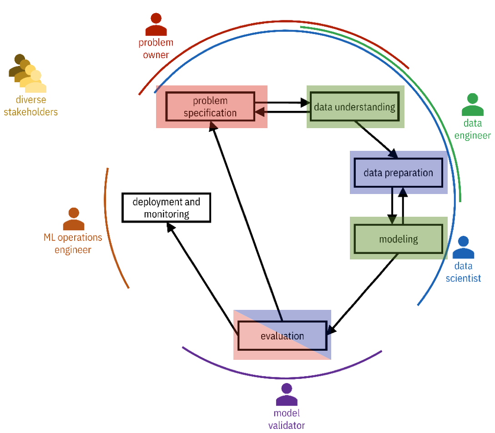
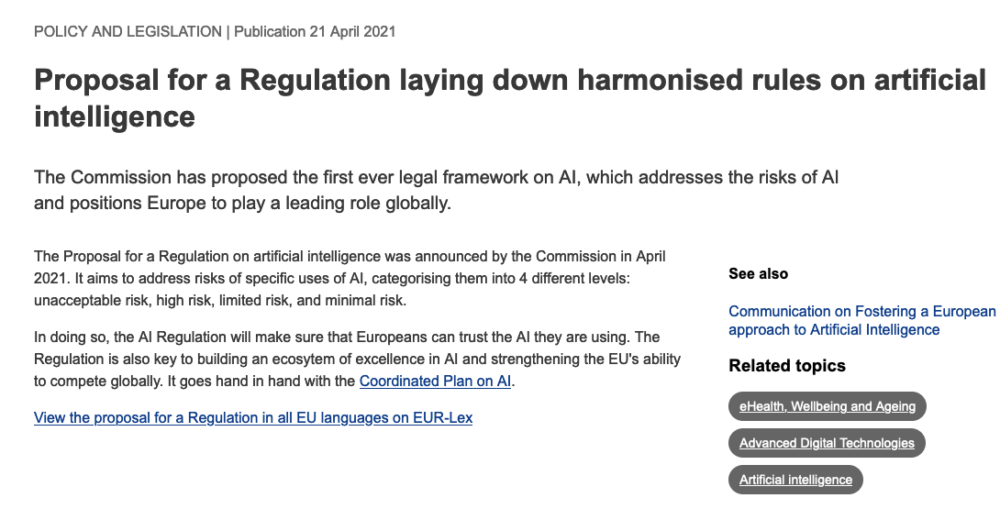
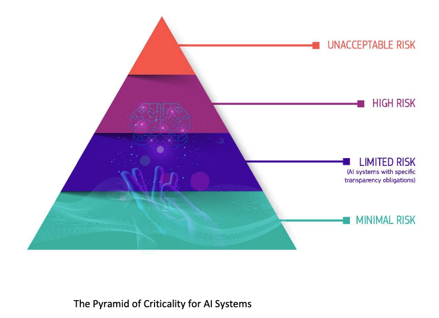
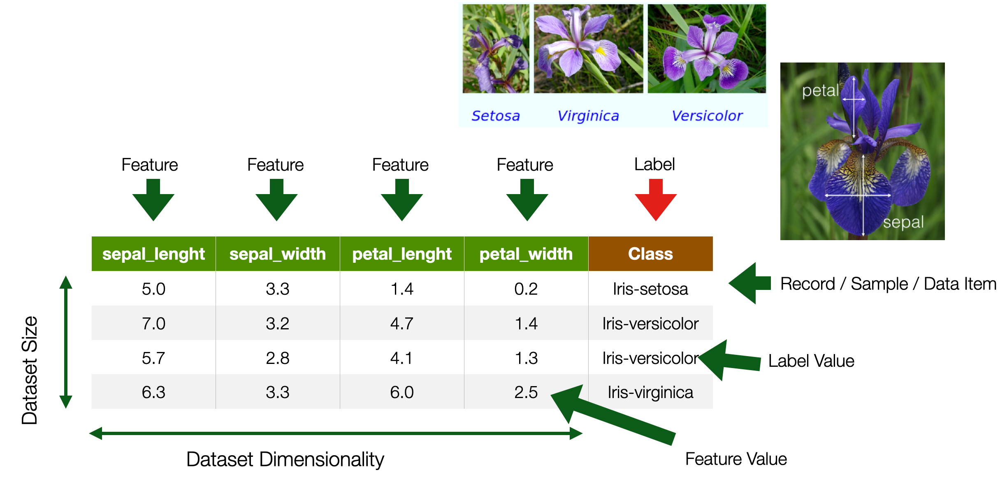
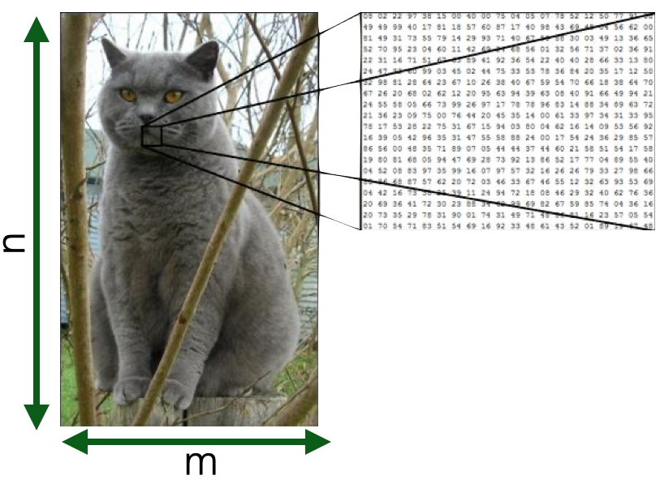
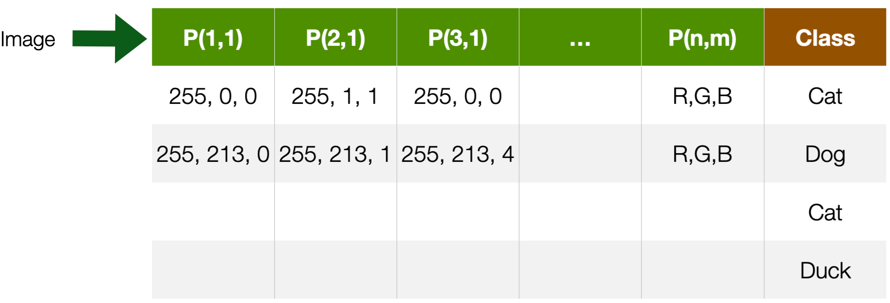
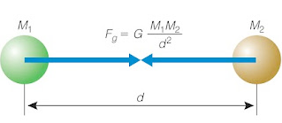
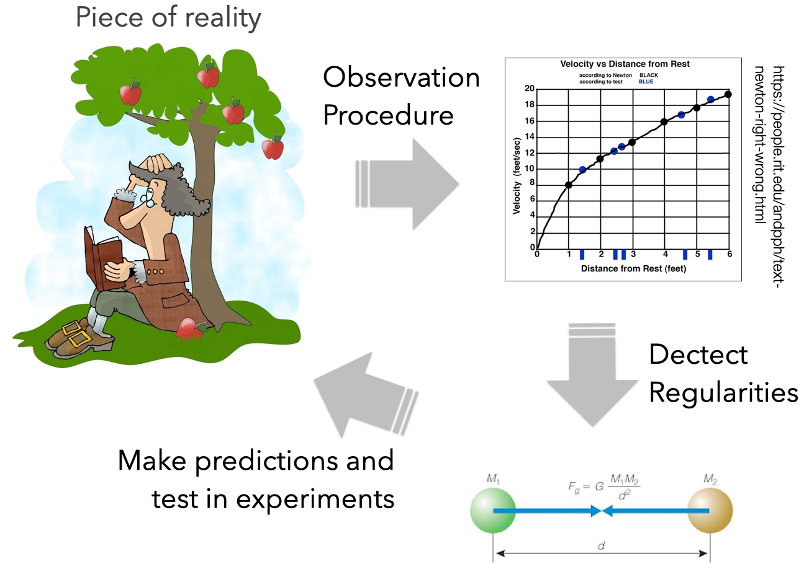
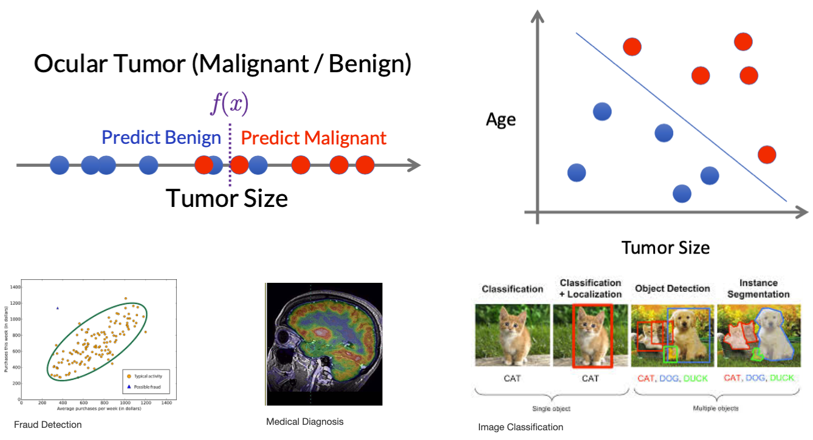
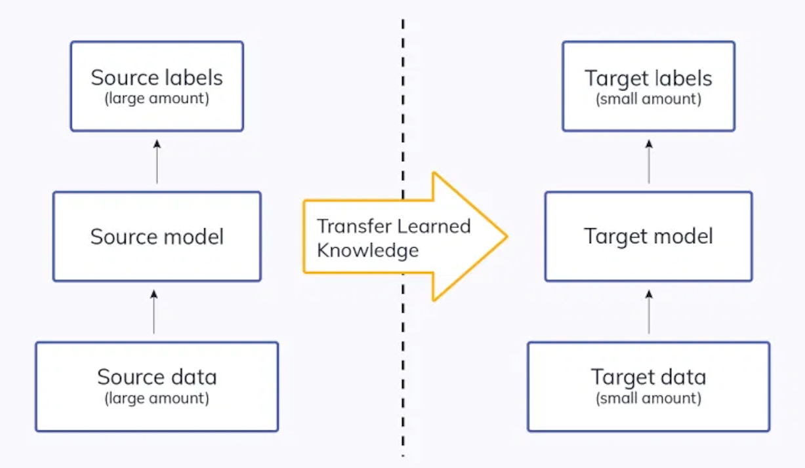

# Lecture 2: Lecture Notes

Version 1.1
Date: 28/02/2023
Author: Alessandro Bozzon

---

## The Machine Learning Life-Cycle

---

### Cross-Industry Standard Process for Data Mining (CRISP-DM) methodology 

https://www.the-modeling-agency.com/crisp-dm.pdf

There is no standardized methodology for designing Machine Learning systems, although several companies have created several proposals in the past. For instance, this [CRISP-DM methodology: Cross Industry Standard Process for Data Mining](https://www.the-modeling-agency.com/crisp-dm.pdf) is the closest you might get to a standardized process for Machine Learning system development. It's not exhaustive, and as we will see, it has some limitations, but it's complete enough, and I think we can use it as a reference moving forward. At least to understand the different actors and the different activities. 

There is a *problem owner*: Someone that is interested in designing this particular PSS that has a Machine Learning-component. You also have diverse stakeholders: people that, in one way or another, have a stake in, if not the design, at least in the output and the consequence of creating this particular Machine Learning-driven solution. 

*Data engineers*: people, mostly engineers, that deal with acquiring and managing the data that will be used later in the ML process. 

*Data scientists*: experts in statistics, data science, and machine learning. 

*Model validators*: those in charge of checking that the system performs as expected. They can be testers operating before the PSS is put into production. Auditors, if their job is to check if the PSS complies with specific regulations and policies. Or, sometimes, end users provide feedback on the product's performance (e.g. a thumbs-up/thumbs-down on a recommendation).

*Operations engineers*: are the ones in charge of making sure that the system runs continuously and effectively. Sometimes they are also called *ML OPs engineers*.

Let us use as an example the recommender system of Amazon. Amazon is the *Problem Owner* for that recommender system. It is a company interested in maximizing revenues using automated procedures suggesting items consumers operating on the platform should buy. Of course, the stakeholders of these systems are the users and companies selling products through Amazon. One could argue: Even society as a whole, because the more gadgets we sell, the less sustainable and the more we're going to waste. 

Within Amazon, there are *Data Engineers* that take care of managing all the data that is needed to run these systems. For instance, the databases containing all the review data from people and products, all the products’ details coming from the suppliers. The *data scientist* is the professional that creates the Machine Learning system, the recommender system, in this particular case. 

The *validator* checks that the performance indicators expected by the problem owner are met (e.g. performance or revenue).  The *operations engineer* looks at the system as such: The computers, the network. That everything runs as quickly and as effectively as possible. But, as I mentioned before, validators can also be users, giving feedback on the quality of the recommendations. 

In a big company, all these people might be different, in small companies or startups, they are a single person. But in a sense, those are the roles that are somehow involved. 

---

### CRISP-DM In our course

We are not going to cover in detail all these steps. For instance, we will not cover the deployment and monitoring step in this course. This is an advanced topic, and it's really about systems engineering, probably not interesting for you. 

We will cover the problem specification and the evaluation of the system. We will study and look at how we can specify what the system should do and how we will evaluate it. 

Data understanding and modeling we will do throughout the course. Data preparation we will address in module three. 

---

### Problem Specification

	What is the problem owner hoping to accomplish and why? 
	Why am I (being asked to) solve it?
	Am I the right person to solve this problem?

	What are the (psychological, societal, and environmental) repercussions of building this technology?
	Should this thing be built at all?
	What are the metrics of success?

This is where you, as designers, should be more comfortable. The process of understanding what the problem owner hopes to accomplish and why. And, to get to the bottom of what exactly are the desires, needs, and requirements of this particular solution that you're asked to design and develop. 

Of course, this also implies considering ethical issues: Should the system be developed? How are we going to measure success? What impact will the system have, maybe, on the broader set of users or society? 

Those questions should be accounted for before creating the system, not after. 

---

### Data Understanding
	==Know your data!==

	Data need to be collected —> Datasets
	What data is available?
	What data should be available but isn’t?

	What population/system/process is your data representing? 
	And what properties of such population/system/process are included (or excluded)?
	What biases (social, population, temporal) are present in your datasets?

*Data understanding* might seem like a purely technical task, but it is not, purely. Data is what makes or breaks a Machine Learning system. So, it is essential to understand what data needs to be collected. Whether this data is available or not. Even if there is data that should be available but is not there. What part of the phenomenon being modeled can the data capture, and which is not? So that if biases exist, they could be identified early.
 
To give a concrete example, consider Social Media (e.g, Twitter) data. One might be tempted to say that data collected through social media, being so abundant, are representative of very large, exhaustive, and comprehensive populations. We know that not to be true. We know that different demographics, and different people, operate on different social media, and we know that they do that in different ways. Quantity does not mean comprehensiveness and diversity to the point that it suits a particular problem. So being VERY inquisitive about the data is a very pragmatic first step for everyone that wants to do something with Machine Learning. 

---

### Data Preparation

	- **Data integration**
		- Extracting, transforming, and loading (ETL) data from disparate relevant databases and other data sources
		- This step is most challenging when dealing with big data sources  

	- **Data cleaning**
		- Filling missing values
		- Transforming value types (e.g. binning)
		- Dropping features that should not be considered 

	- **Feature engineering** 
		- Transform the data to derive new features

Data does not exist in a vacuum, and it is not created "perfect." It is the result of complex socio-technical processes that might lead your data to be "messy," Incomplete, with errors of different types. Data comes from multiple sources, so they must be aligned and integrated. 

In the real world, the data work is 80% of the work, while the modeling work is only 20%. Data understanding and preparation take (or should take) most of the time in the design and development process for ML systems. 

---

### Modeling 
	- **Select** a training algorithm
	- Use it to **find patterns** in the training dataset
	- **Generalize** them to fit a statistical model 

	- **Enhance** the model to satisfy additional objectives and constraints captured in the problem specification
		- e.g., increase reliability, mitigate biases, generate explanations
	- **No free-lunch theorem**
		- There is no one best machine learning algorithm for all problems and datasets

Once the problem is defined, and the data are prepared, then we can start to pick the right Machine Learning model and the right training algorithm. This is [in theory] conceptually easy, but it is complex in practice. And the reason is that **there is no such thing as a best possible solution applied in all possible conditions**. 

That is the so-called “no free lunch” theorem. There is no one best Machine Learning solution for all problems and datasets. We have a portfolio, and a bunch of potential alternatives, each one is more or less suited according to the class of problems you have and the type of data you have available. 

--- 

The slide mentions four steps. The *training* and the *enhancement* are activities performed by data scientists through algorithms, while the *model* is the final result. 

The Machine Learning *model* is the computer program (in reality, it often looks more like a configuration file) that is created using injecting the data and letting the system learn from this data. **Model training** is the activity performed by a **training algorithm** (configured by the data scientist) to create that Machine Learning model. For instance, given many examples of cats and dogs, the **model training** step is concerned with finding the statistical correlation between the input data and the classes (*cat* and *dog*) that we want to recognize. The **model** is the program that, based on the observed statistical correlations, can distinguish a cat from a dog. 

We are separating *training* and *enhancement* because, oftentimes, activities happen *after* the training of a model to ensure that the model behaves according to expected behavior. For instance, to check (and eventually fix) biased behaviours against specific type of data, or the people (e.g. a specific population or minority) that this data represents. 

---

### Evaluation
	- Testing and validation of the model
		- Also against the problem specification requirements 

	- Performed on data not used for training 
		- Hold out dataset 

---
#### 	Model auditing/risk management

*Evaluation* is also a very important step because this is where one can check whether the system that has been created is compliant with its initial expected properties. Evaluation is complex for several reasons that we will explore later in the course.

These systems are stochastic, and they're probabilistic. This means that, in practice, they will **never**  with 100% accuracy performance. A Machine Learning model trained to recognize **cats** versus **dogs**, is bound to make wrong classifications, sometimes. There are many reasons a prediction can fail (mostly due to the properties of the data). 

ML systems *never* operate perfectly. Sometimes, they fail. But we use them because they are helpful, not perfect. It is essential to know how to deal with those errors. This is an interesting interaction design and design-interaction challenge. 

But also an ethical one: if it is true that these systems are not perfect, when (if ever) shall we use them? Are there situations where perhaps we should not use them at all? This is the core of the current, ongoing efforts to regulate Artificial Intelligence in Europe. It's an ongoing process built on a risk-based approach in defining under which conditions and under which particular situations the risk of using one of these systems is acceptable. 

There are four classes: *Unacceptable*, *high*, *limited* and *minimal* risk. And each one of these risks is associated with particular demand in terms of required checks and controls on the performance of the system, the understanding of its potential limitations, and, of course, also compensatory actions. 

To give some examples. The recommender system of Netflix will probably fall in the *minimal risk*  application. In the worst-case scenario, if the system does not work well, a user receives a recommendation for a movie they do not like: tough luck! 

Risks are considered *Limited* when the malfunctioning of the system might have effects that have some consequence, but they are not too problematic. For instance, a system that is designed to classify whether content is inappropriate fails 5% of the time. There is some risk: people can be offended or traumatized. But as long as these mistakes can be corrected in the future, it is fine. AI chatbots, spam filters, and customer management sustems fall into this category. 

 *High risk* are those systems that "either pose a health and safety risk or pose a risk to people’s fundamental rights". And here, the requirements are very strict. The legislation includes in this category: 

- biometric identification and categorisation of natural persons
- management and operation of critical infrastructure
- education and vocational training
- employment, worker management and access to self-employment (e.g. recruitment systems)
- access to and enjoyment of essential public and private services and benefits
- law enforcement
- migration, asylum and border control management
- administration of justice and democratic processes

Note that the list of critical areas are still in discussion, and currently subject to variations. For instance, the Parliament is currently considering placing conversational and art-generating AI tools such as ChatGPT and DALL-E-2 in the high-risk category. 

*Unacceptable risks* happen in those situations where under no circumstances should it not be allowed for an A.I. system to operate. These include:

- "subliminal, manipulative, or exploitative techniques causing harm"
- "Real-time, remote, biometric identification systems used in public spaces for law enforcement"
- All forms of social scoring

Some people believe, for instance, that we should not be allowed to design a system for military purposes. Of course, other people disagree. 

---

### Deployment and monitoring

	 - What data infrastructure will bring new data to the model?
	 - Will predictions be made in batch or one-by-one?
	 - How much latency is allowed?
	 - How will the user interact with the system?
		- Is there a problem here?

	 - Tools to monitor the model’s performance
		- And ensure it is operating as expected

*Deployment and monitoring* is about the actual operation of the system. It is a phase that addresses important needs, although not necessarily needs that a designer would care about too much. For instance, *latency*, how quickly a system can respond to user interaction. A system like Google Search, for instance, is engineered to answer queries in less than 100 milliseconds. If for whatever reason, the intelligence behind Google is slower than that, it has been empirically demonstrated that the company will lose business and they will lose money. So, it is their best interest not to delay the user experience. MLOps Engineers are tasked to ensure that the system works as fast, as fluidly and as, well, as best as possible. There are, of course, trade-offs. Not all systems can be, for instance, accurate and also be fast. Take for instance a computer vision system installed on a car: if such a system is not powerful enough, then recognising an object might be too slow, and so the car might exhibit a higher reaction time and eventually bump into something or somebody. That is unacceptable. A solution would be to put a more powerful system on the car (but more expensive); or let the system run faster but will less accuracy. 

---

## Data
### The raw material 

Data, or the raw material of A.I. If you have read the suggested reading material for today's lecture. “I, pencil”, which is a lovely, short essay. You’ll know where this reference is coming from.

---

### Data

In our collective imaginaries, data looks like a table. Or so-called **structured data**. And, most of the time, that is the case. And, it turns out, it is a useful and generalisable abstract representation for ML purposes. 

A **Dataset** is a collection of **record**s. 
A **record** is a row in a table; in the context of ML, a record is called a **sample**, a **data item**, or an **instance**. In the *IOB-3-22 Data Course* they were called **Data points**, with the following definition: "units of information, usually collected through observations by people or machines. Data points can be single facts or observations
(e.g., the age of one individual child incorporated in the dataset, or the temperature measured at one location at a given time), or multiple corresponding values (e.g. set of
environmental variables)". This definition is, of course, compatible with ours. 

A record is composed of **attributes**, the columns. In Machine Learning parlance, those are called **features**. A feature is a property of the world modelled by the data; the property is captured, measured, and represented for the prediction problem we have in mind. 
Let us use the example in the slide. The goal is to create a system that can recognize the species of a flower based on the geometrical properties (width and length) of their petals and sepals. Notice how, in this case, someone decided that a *flower*, a creature, is represented by these attributes; other attributes, like colour and shape, were not included. A record therefore represents a real-world flower; the value of the features (*feature values*) are the ones of that flower.  
Later we will see that features might take different representations according to the data type (e.g., an image or a textual document). 

There is a very specific column called **label**, or **class**, that contains the value that the system is expected to be predicting -- i.e., the prediction output. So, for instance, if you want to train a Machine Learning system that can recognize flower species (given a set of sepal length, width, and petal length and width), the *label* allows the algorithm to find a statistical correlation between feature values and the flower type. 

Note that a label might not always be present. 

The **dataset size** is the number of records available in our dataset. Dataset sizes matter in Machine Learning because, as discussed in previous lectures, ML methods are data-hungry: the more data you have, the better (usually). **Dimensionality** is the number of features representing a particular entity. Later we will encounter a concept called *curse of dimensionality*: the problem that too many features represent a data item. 

---

### Types of Features / Label Values

	- **Categorical**
		- Named Data
		- Can take numerical values, but no mathematical meaning
	- **Numerical**
		- -Measurements
		- Take numerical values (discrete or continuous)

Data values can have different types. A type holds properties that allow doing some specific operation with data values. 

You must understand the difference between these data types. As we will see later, Machine Learning systems, being statistical systems, prefer to deal with numerical values more than categorical ones. It is a common practice, for instance, to translate categories into numbers and text into vectors. We will see several examples of this in the next modules of the course. 

It is also important to distinguish the notion of **Data Types* as you have encountered in the *IOB-3-22 Data Course* from **Feature Type**. Data types include: integer (any whole number, without a decimal point, e.g., 7); float (any
number with decimal point, e.g., 7.43) date (a particular year, month, and day in time); time (a particular moment of day); text (any collection of letters rather than numerals or
other symbols, also referred to as ‘string’ or ‘character’); and boolean (a binary data type with only two values: i.e. either TRUE or FALSE; Yes or No; 1 or 0). 

---
	#### Categorical **Nominal** 
	- No order
	- No direction
	- e.g. marital status, gender, ethnicity

	#### Categorical **Ordinal** 
	- Order
	- Direction
	- e.g., letter grades (*A*,*B*,*C*,*D*), ratings (*dislike*, *neutral*, *like*)

===CHECK THE DATA KEY CONCEPTS===

It is very common to deal with *categorical* data. These data could be either textual or numerical, but for which **there is no mathematical meaning** attached to it. Take, for instance *Marital Status*: there is a close number of statuses. It is a string (e.g., "Married", "Single"), it could also be represented as a number (e.g., "0", "1"), but no arithmetic operations can be performed ("Married" - "Single" = ?).  

*Marital status* is a **nominal** categorical data type because there is no way to order values (Is "Married" greater/better than "Single"?). 

**Ordinal** data are categorical data with an order and a direction. Think, for instance, of letter grades: *A* *B* *C* *D*. We know that A is greater than B, and B is greater than C, so there is an order and a direction, but still, you cannot do A minus B or C minus D. It doesn't make any mathematical sense.
Another example of *Ordinal* data are the classical Likert scales -- e.g., *Dislike*, *Neutral* or *Like*. *Dislike* is worse than *Like*, but *Like* - *Dislike* is not equal to *Neutral". 

All of those are categorical data, we use them all the time, and, from a statistical perspective, they come with a lot of strings attached because there are things that you cannot do with this type of data that you can do, instead, with the other type. We cannot dig deeply into this topic, but it will be extensively addressed in the Design Analytics [IOB6-E8]  elective course. 

---

	#### Numerical **Interval**
	- Difference between measurements
	- No true zero or fixed beginning
	- e.g., temperature (C or F), IQ, time, dates

	#### Numerical **Ratio** 
	- Difference between measurements 
	- True zero exists
	- e.g., temperature (K), age, height

**Numerical data** is used when measurements are involved, e.g., measuring someone's height or weight. Numerical values can be continuous (i.e., real numbers) or discrete (i.e., integers); and, of course, they can be part of mathematical operations. Note that boolean values (0 and 1) are also numerical. 

**Ratios** are numerical values used to represent properties like *age*, *height*, *weight*, *width*: these are properties for which there exists a *true zero*. Temperatures, for instance, but measured in Kelvin, where there is a zero -- the lowest possible temperature there is in the known universe. But that's not the case, for instance, with temperature in Celsius or Fahrenheit, where there isn't a zero. 
The same goes for dates and times. You can subtract them, for instance, one year minus the other, but there isn't a scale and a fixed point. We call them **intervals**. 

---

### Data Modalities

Regarding modalities, data can be split into two big families: **structured** and **unstructured** (or semi-structured) data. 

**Structured data** is data that comes in some predefined format: Tabular data, like the one that we saw in the example before. This is data for which there exists a pre-existing organization: attributes are explicitly defined. 

**Unstructured data** does not have an intrinsic structure—for instance, images, music, and text. 
Of course, images contain shapes and patterns, but there is no explicit way to describe such pictures because, essentially, an image is a collection of pixels. 

In the same way, you can think about *text* being a collection of words. Textual documents like papers, newspapers, etc. indeed have some structure (e.g. introduction, conclusion). However, how the words are organised in a text does not follow any specific structure -- besides, perhaps, grammar rules. 

---
### Key Dimensions
|==Modality==    | ==Quantity==    | ==Quality== |   ==Freshness==    | ==Cost==    |
|----|----|----|----|----|
| Structured   | Number of records   | Errors   | Rate of collection  | Acquisition   |
| Semi-structured   | Number of features   | Missing data   |    | Licensing   |
| |   | Bias   |    | Cleaning and integrations   |

What properties make data "good" or "bad"? "Useful" or not "useful"?

**Modality** as discussed previously. 

The **quantity**. The number of records, the *dataset size*.  But also the *number of features*, as we will see also later on in the course, the number of features available can either be a blessing or a curse: the more features available, the more detailed description of a data item; but the more features, the more the data items we need to have to train a good machine learning model. 

The **quality** of the data is also very important because the data might contain mistakes. To believe that the data is "correct" is, most of the time, wishful thinking, an illusion. In a dataset, data is often missing due to collection errors or technical issues. And data is ==always==  biased for multiple reasons: 1) the collection process,  2) the specific condition in which the data has been acquired, 3) the design choices in the data acquisition process itself. 
You had an example before about social media data: biases can creep on because there is an uneven distribution of people and topics. 
Remember: there is no such thing as objective, neutral, and unbiased data, there is always a bias in the data. 

**Freshness** means how often new data is generated. Some data sources, like census data, are updated in the best cases every year and in the worst cases every decade. Freshness (or lack thereof) can be a problem depending on the ML goals: some system requires fresh data (e.g., a news recommendation system, a malfunction prediction system), while others don't (e.g., a system recognising defective items in a production line). 

To track your heart rate and to predict whether you are going to have some heart issue, you might want to sample your heart rate frequently. Higher sampling rates might not be needed.

**Cost**. Cost is also significant because cheap data is not necessarily good data. And there is a cost for cleaning and integrating it, so that's also a consideration.

---

### Static Tabular Data

This type of data we have seen before. 

---

### Time Series
	- tabular data with **time** feature
	- For instance
		- Sensor data, Stock market data
	- Label is usually associated with a set of records
		- e.g. a continuous movement of the phone indicating an action

**Time series data** are structured, like tabular data, but have two fundamental differences. 1) One of their features is a time-stamp: this is because the reality that time series represent has time as a critical component. 2) Labels can be associated with *sets* (more than one) data items, because what needs to be recognized spans multiple time stamps. For instance, recognizing the type of activity a person performs (e.g., walking vs. Running) based on accelerometer data requires more than one data item. 

---

Time series data are very interesting data, but we are not going to cover them in this course.

---

### Images
	- Visual content acquired through cameras, scanners, etc. 
	- Each pixel in an image is a feature
		- But spatially and geometrically organised 
		- e.g., edges, corners
	- Feature values are numerical values across channels
		- e.g., *R,G,B*
	- Dimensionality --> *n x m*

Images are nothing more than a set of pixels. And each pixel in an image is a **feature** having a value (e.g. scale of grey, RGB, CMYK) that tells you something about that particular pixel. 
Now you can understand why I mentioned the problem of the "curse of dimensionality" before: in an image, especially a high-resolution one, the number of features can be in the order of millions, making computation very expensive. 

There are ways to avoid the curse of dimensionality: for instance, in traditional computer vision, a process called *feature engineering* was used to compute features (e.g. edges, corners, or shapes) from images *before* training a machine learning system. We will discuss this issue more in the coming module. 

---

	More in ==Module 1==

---

### Textual documents
	- Sequence of alphanumerical characters
		- Short: e.g. tweets
		- Long: e.g Web documents, interview transcripts 
	- Features are (set of) words
		- Words are also syntactically and semantically organised
	- Feature values are (set of) words occurences
	- Dimensionality --> at least dictionary size 

The issue of dimensionality also occurs with textual documents. A textual document is nothing more than a sequence of words. Texts can be short (a Tweet) or long (a novel). They can be created in many scenarios and applications: e.g. reviews on Amazon or interview transcripts. 

As words have their meaning, it is very common to consider each word in the dictionary a feature that can either be present (or not) in a document: we call this representation “bag(s) of words”. The value of the feature is whether the word is present, or not, in a particular document.

There are also more complicated ways to represent documents, that will look at sequences of words, i.e. words in their order. 
 
---

	More in ==Module 2==

---

### Data Sources
| ==Purposefully Collected Data==  | ==Administrative Data== | ==Social Data==  | ==Crowdsourcing== |
|----|----|----|----|
| Survey   | Call records   | Web pages   | Distributed sensing   |
| Census   | Financial transactions   | Social Media   | Implicit crowd work (e.g. captcha)   |
| Economic Indicators   | Travel Data   | Apps   | Micro-work platforms (e.g Amazon Mechanical Turk)   |
| Ad-hoc sensing   | GPS Data   |  Search Engines  |    |

Different data sources have different properties  in the five dimensions mentioned above: *modality*, *quantity*, *quality*, *freshness*, and *cost*. 

*Purposely collected data* are collected specifically for a specific goal:  Surveys, censuses, and scientific experiments done with very expensive equipment. They are created using ad-hoc sensing infrastructure specifically designed to collect the data for the prediction purpose that we have in mind. Most of the time, this data comes in a structured way. They are very expensive to acquire, and they have very high quality but might not have high freshness—for instance, census data. Data from sensors or sensing infrastructure are high-frequency and high-quantity, but the cost is very high. 

The following type of sources includes **re-purposes* data.  That is, data that is not created for the prediction purpose at hand but they are reused from other scenarios or application domains. 

Typical examples are *call records*, which is data collected by network operator companies when your phone downloads data, or when you are making a phone call. It is very common to perform prediction tasks on this data: for instance, to predict the behavioral or consumption patterns of people. Another example is financial transactions with a credit card. These are data that are not created to infer the consumption properties of a person, they're just created for the sake of keeping track of who spends money where. Another example are travel data from the “OV chipcard”. 

Mostly structured, very high quality, very quantitative, sometimes also very high freshness, but then again, they're very, very expensive. Either you need a very expensive infrastructure to acquire them or they are privacy sensitive. 

The data that we use the most are **social data**: Data from the web, from social media, from apps and search engines, billions and billions and billions of documents, images and videos. Mostly, this is unstructured: Images, audios, text. They are low-cost to access, but the quality is not necessarily high. 

Finally, there is **crowdsourcing**: distributing data collection and processing to people,  implicitly or explicitly. For instance, every time you solve one of those “CAPTCHA” for Google, you are performing a data labeling operation. People can also be paid for this on microwork platforms like Amazon Mechanical Turk. In this case, all data properties are primarily mid-low because you need to pay people, but these people are not your employees. For this reason, quality also varies greatly.

---

### Data Sources
| ==Purposefully Collected Data==  | ==Administrative Data== | ==Social Data==  | ==Crowdsourcing== |
|----|----|----|----|
| *Modality*: mostly structured   | *Modality*: mostly structured   | *Modality*: mostly semi-structured   | *Modality*: all   |
| *Quantity*: low   | *Quantity*: high   | *Quantity*: low   | *Quantity*: mid-low   |
| *Quality*: high   | *Quality*: high   | *Quality*: low | *Quality*: mid   |
| *Freshness*: low   | *Freshness*: high   |  *Freshness*: high  | *Freshness*: mid   |
| *Cost*: high   | *Cost*: high   |  *Cost*: low  | *Cost*: mid-low   |

---

## Categories of Machine Learning

---

### How do machines learn?

How do machines Learn? We encountered this diagram earlier in the lecture. It is important to distinguish two elements here: *Model Training* is the activity through which a machine learning model is created. This is an algorithm, typically available in a software library that allows you to create a ML *model*. But, what is a model, exactly?  

---

### On Models
	> A physical, mathematical, logical, or conceptual representation of a system, entity, phenomenon, or process

	- A **simple(r)** representation of reality helping us understand how something works or will work.
		- **Not** **truthful**, just a **useful** one
	- The goal of models is to make a particular part or feature of the world more accessible to understand, define, quantify, visualise, or simulate

Generally speaking, when we talk about models, we refer to physical, mathematical, logical, or conceptual representations of a system, an entity, a phenomenon, or a process. For instance, the "model of a product" is a representation of a product (e.g. a sketch, a schema, a low-resolution prototype) that is not as good, as complete, or as detailed, as the real product. Still, it is good enough to understand how or how it could work. A model is not meant to be a truthful and accurate representation of reality. It is meant to be a *useful* representation, that has the function of making a particular part or feature of the world more accessible to understand, define, quantify, visualise, or simulate.

---
### Examples of models
	Architecture plans
	Maps
	Music Sheet
	Mathematical laws of physics!
	==Machine Learning== (statistical) Models  

Models are everywhere around us, even if we don't realize it. A *music sheet*, for instance, is model: it is a structured, visual representation of sequences of musical notes. It represents how a musician should play a tune, and of how such then should sound. The representation (the notes) does not match 100% the final sound: that is the task and responsibility of the musician. 
A *map* is not a high-fidelity representation of the world but is good enough for you to navigate in it. Architectural plans [blueprints], even the laws of physics, in a way, are simplified representations of reality that we create to more easily understand, define, quantify, visualize, or simulate a particular part or a particular property of the world.

Machine Learning models are statistical models that we know are created from data. The availability of a mathematical representation can, however, give the wrong impression that machine learning models are "models of the world", as scientific models can be. So, let us spend some time discussing differences. 

---

#### Scientific Models
	- GOAL: ==explain reality==
	- Created to make predictions about the outcomes of future experiments
		- e.g., apples on the moon
	- Tested against the **outcome**
	- If data from new experiments don’t agree, the model has to be modified/extended / refined
		- Falsifiability 
	- Scientific models should be *small* and *simple*.
	- They should generalize phenomena observed in new ways.

At school, we encounter the scientific method. Given a reality of interest, through observations and measurements, a scientist tries to understand if mathematical laws could explain regularities in the collected data. For these laws to be correct (that is, a good explanation of reality), they should allow making predictions about the outcome of experiments performed in different contexts.  If the prediction holds, we deem the model, the physical law, true. If it doesn't, we consider it falsified, and in need of an update. Consider for instance the law of gravity. We know that the very simple formula $[F=m•a]$ allows us to accurately predicts not only the movement of objects on earth, but also in space, or on other planets.

---
#### ML Models
	- GOAL: ==describe the data==
	- Designed to capture the *variability* in observational data by exploiting regularities/symmetries/redundancies
	- A good ML model doesn't need to explain reality, it **just describe data**
	- They don’t need to be simple or transparent, or intelligible. Just **accurate**
		- *Black box*
	- ML models may be large and complex.
	- They should generalize to new data obtained in the same way as the training data
		- Same application context and data acquisition process

Machine Learning is about *representing the data*, **not** about *representing reality*. More specifically, ML approaches try to capture regularities in the variability in the data. 
An implied assumption when working with ML models is that such data is somehow good enough to describe a reality of interest. So it follows that by being able to describe data that describes reality, one could “describe” reality. This is a logical inference with profound consequences and the major source of misunderstanding on the actual capabilities and limitations of an ML model. 

Machine Learning models are complex mathematical artefacts that are supposed to be very accurate in capturing the data on which they are trained upon. *Generalization* for Machine Learning is not about being able to make predictions about any possible data acquisition contexts, but just in the same context as for the original training data. 

Note that ML models can models pick up on *spurious correlations*: input-output associations that are just a bi-product of data properties -- think about [The Neural Net Tank Urban Legend](https://gwern.net/tank) we discussed in class.  
These spurious correlations can lead to incorrect or over-simplified predictions that can again lead to safety risks. 

This is why the ==know your data== action described earlier is so important: *Where is the data coming from*? *What does (and doesn't) it represent*? *How much can the same data be used to operate in another domain or for another problem*? 

By having a vast amount of observations (data), in many different contexts and many different situations, it would be possible (hypothetically) for a Machine Learning model to distill a simple, elegant law of physics. But that would happen in a much more complex way than what could be achieved by reasoning and intellect.  

---

---
### Supervised Learning
	- Input: **labeled** data
		- Data + expected prediction
	- During training, labels are used to associate patterns with outputs
	- Learns how to make input-output **predictions**

	- *Classification*
	- *Regression*
	- *Ranking*
	- *Recommendation*

**Supervised learning** is a type of machine learning that is trained over **labeled** data to create models that can predict the labels of new data items. 

Supervised learning is one of the most common types of ML approach, used in many real-world applications. To give a few examples:

- Predicting house prices based on the house’s size, number of rooms, and location
- Predicting tomorrow’s weather based on yesterday’s temperature, humidity, and environmental factors 
- Detecting spam and non-spam emails based on the words in the e-mail 
- Recognizing faces/objects/animals in images based on their pixels
- Recommending videos or music to a user (e.g., on YouTube or Spotify)
- Diagnosing patients as sick or healthy

We can identify two main types of **tasks** that could be performed through supervised learning: **Classification** and **Regression** (see later). 

Supervised learning models can also be used for two other tasks: 
- **Recommendation**: the machine learning model learns how to predict **set of categorical data**. The output of a recommendation model is a *set* (a collection) of data items. For instance, a set of videos to watch next. 
- **Ranking**: the machine learning model learns how to predict **list of categorical data**. The output of a ranking model is a *list* (an **ordered** set) of data items, ordered according to given criteria—for instance, the results from a search engine. 

---

---
#### Classification
	- Learn to output a **category label**
	- Binary
		- e.g. *Spam* / *not Spam*, *Cat* / *not cat*
	- Multi-class
		- e.g. *cat*, *dog*, *bird* 

**Classification**: the machine learning model learns how to predict **categorical data**. The output of a classification model is a *category* (e.g. spam / not spam; cat / dog; sick / healthy)

---

#### Regression
	- Learn to output one or more **numbers**
		- e.g., value of a share, number of stars in a review

**Regression**: the machine learning model learns how to predict **numerical data**. The output of a regression model is a *number* (e.g. tomorrow's temperature, the value of a stock, the cost of a home, the expected days of recovery for a sick patient).

---

### Unsupervised Learning
	- Input: **unlabeled** data
	- The machine learns structures (patterns) from the data without human guidance

	- *Clustering*
	- *Dimensionality Reduction* (e.g. Large Language Models)
	- *Anomaly detection*

**Unsupervised learning** is a type of machine learning that is trained over **unlabeled** data. The goal of the model is to extract as much information as possible from the dataset.

To give a few examples:

- Customer/User segmentation, i.e. grouping people in different categories based on data representing their properties or behavior
- Detecting fraudulent behaviour in payment transactions
- Detecting defective mechanical parts 
- Categorize documents (e.g. articles, interviews) based on the words in the documents 
- Discover trends I customer behaviour.

We can identify three main types of **tasks** that could be performed through ubsupervised learning: **Clustering**, **Dimensionality Reduction**, and **Anomaly Detection**. 

---

---

#### Clustering

Clustering algorithms group data into *clusters* based on **similarity**. The idea is to create groups (clusters) of items that are more similar to each other than to those in other groups. 

**Similarity** is calculated through a *metric*, a function determining how two data items are close to each other in a given feature space. For example, customers could be grouped based on their demographics (age and gender segmentation), buying habits (e.g. types of products they buy), or a combination of different features. Documents could be grouped by the frequency of co-occurrence of certain words. 

---

#### Dimensionality Reduction

Dimensionality reduction is a task aimed at *simplifying* data before applying other techniques (e.g. supervised learning). Simplification here means reducing the number of features in a dataset by finding the ones that are more *discriminative*, i.e. they can capture diversity in the data the most. Dimensionality reduction could also mean *transforming the data*: features could be "merged" so that as little information as possible is lost while keeping the data as intact as possible. 

Note that dimensionality reduction techniques are at the core of many (if not all) **generative machine learning** techniques and tools you can find on the news daily. 
Given a dataset, generative learning techniques are trained to generate new data points that look like (belong to the same distribution as) samples from that original dataset. These algorithms learn regularities and variabilities in the data, and apply dimensionality reduction techniques to reduce (simplify) the representation space of data items. Later in the course, we will discuss examples of generative machine learning techniques and explain - in simple terms - how a technology like ChatGPT works. 

---

### Semi-Supervised Learning
	Combination of **supervised** and **unsupervised** learning
	Few **labeled** data in the input are used to create **noisy labeled data**
	With more labeled data, the machine learns how to make input-output **predictions**

**Semi-supervised learning** is a machine learning technique that combines supervised and unsupervised learning to deal with situations where acquiring abundant labeled data is too expensive. 
Semi-supervised learning allows training a supervised model only having a limited amount of labeled data. The idea is conceptually simple: using a few labeled items, a supervised ML model is trained. This model will probably perform "sub-optimally", but it will probably be able to capture some statistical properties of the data. This lower-quality model is then used to analyze (e.g. classify) all the other data, creating a so-called *noisy label*. All the data (the manually labeled one and the noisy labeled one) is then fed to another supervised model. By expanding the set of labeled data, it should be possible to learn additional properties (patterns) of the dataset, thus improving overall performance. 

Note that, generally speaking, a semi-supervised learning model has a lower performance than a comparable supervised learning one as, obviously, is more noise in the training data. Another disadvantaged is that biases potentially present in the original labeled set are also more likely to be propagated. However, semi-supervised learning techniques are cheaper and allow quicker prototyping and experimentation. 

---

---

### Transfer Learning
	Often called *fine-tuning*
	Reuse a model trained for one task is **re-purposed** (tuned) on a different but related task
	Useful in tasks lacking abundant data

**Transfer learning** is a technique that allows one to take a model trained for a specific task and re-purpose it for another one.  For instance, imagine somebody created a model to recognize *cats*, but the task is to create a model to classify *dogs*. As, arguably, *cats* and *dogs* share several visual features (e.g. they all have ears, eyes, and noses) the original model could be **fine-tuned** to recognised dogs. The process of fine-tuning implies re-using some of the knowledge previously acquired in an existing model and its adaptation in the new model through a process of partial retraining. 
Models created through transfer learning may be less accurate than models created through supervised learning. Transfer learning is commonly used these days, especially in computer vision and natural language processing.  

---

---

### Reinforcement Learning
	Data about the **environment** and **reward function** as input
	The machine can perform **actions** influencing the environment
	The machine learns behaviours that result in **greater reward**

In reinforcement learning, the machine learning system is given no training data, but only information about 1) the **environment** when the system operates, 2) a set of **actions** that the system can perform in the real world, and 3) a **reward function** that expresses how the environment has *rewards* or *punishes* the system to guide it to reach its goal (or a set of goals). The training of such a system happens by allowing the system to "navigate" the environment while finding a balance between *exploration* (i.e. test actions and their eventual reward/punishment) and *exploitation* (i.e. use existing knowledge to achieve a given goal).

Reinforcement learning finds several interesting applications. For instance
- Games: for instance, the AlphaGO system is based on RL technology
- Robotics: reinforcement learning is used extensively in robotics to allow robots to learn from their interaction with the environment
- Self-driving cars: for instance, for path planning or to learn how to behave in particular environments.
- Chatbot interaction, for instance ChatGPT,

---

---
### Don’t forget domain expertise
	- ML makes some tasks automatic, but we still need our brains
	- More in ==Module 3== and ==Module 4==

	- Defining the prediction task
	- Define the evaluation metrics
	- Designing features
	- Designing inclusions and exclusion criteria for the data
	- Annotating (hand-labelling) training (and testing) data
	- Select the right model
	- Error analysis

This last slide is simply a reminder about the importance of design activities for ML systems. While the technical and engineering processes of creating a well-functioning ML system are very important, essential work takes place **before** a model is even trained.  

---
# Machine Learning for Design
	Lecture 2
	Introduction to Machine Learning. *Part 2*
