# Lecture 3: Lecture Notes

Version 0.9
Date: 28/02/2023
Author: Alessandro Bozzon

---

## A bit more on regression and classification
#### And your very first contact with (deep) neural networks

---

### Linear Regression

--- 

Background: media/true

Let us start with the *regression* problem and take the simplest, although still very used *linear regression* model. 

The idea is simple. We have data points in a multi-dimensional *feature space* and their associated label value. The problem at hand is to determine a mathematical model (a function) that best captures the relationship between these data points in that feature space. The goal is to be able to calculate the *label value* of new data items accurately. 

In the simple example here, the problem is to estimate the cost of a house (the label) based on its size (the feature). So it is a simple 1-dimensional problem. And we can describe the data points as in the figure. For each data point in blue, we know the house size and its corresponding value. 

---

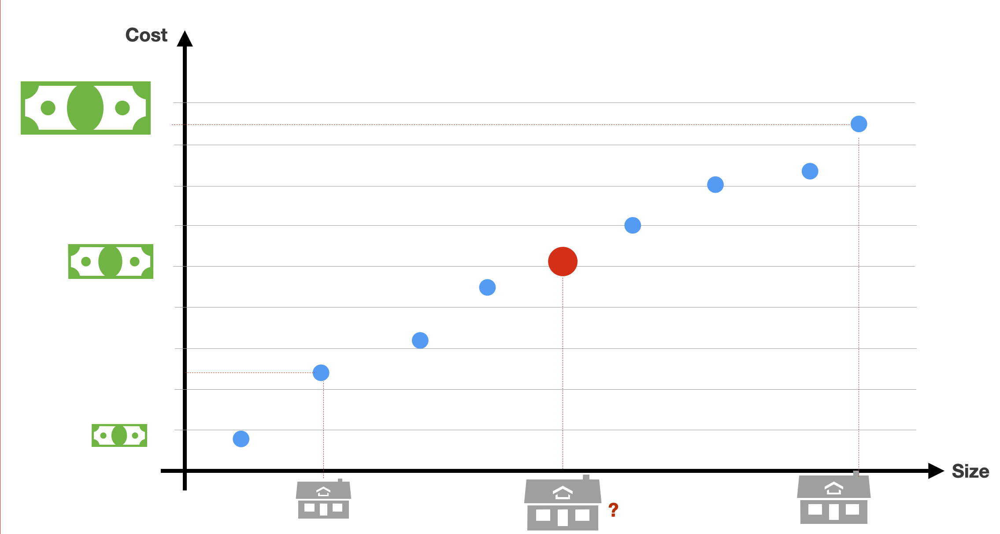
Background: media/true

How can we estimate the value of a new house, represented here with the red data point? Visual estimation is, of course, not possible in the real world, where the dataset size or the feature dimensionality is much bigger. 

---

Background: media/true

The idea is to find a mathematical function, in the case of linear regression, a linear function (a straight line) that best approximates (i.e. *best models*, *best fits*) the data in our possession. The linear function is our model. 

The linear function is mathematically expressed as in the slides. The function has only one variable (*Size*), and the value to calculate is *Cost*. *b and x are the function's parameters: *x* is the intercept (a constant value, or **bias**), and *b* is the slope of the linear functions. In machine learning lingo, these parameters are often called the **model's weights**. 

Not that the bias is not attached to any feature, but its function is to tell us what the output would be in a data point where all the features are precisely zero. In our 1-dimensional feature space, bias allows you to "move the line up and down" on the y-axis, to fit the prediction with the data better. Without bias *b*, the line would always go through the origin point (0,0), thus yielding a poorer fit.

We aim to find the value of *x* and *b* for which the function is a better fit for our data. How could we do this? 

---

Background: media/true

To explain the method, we simplify the problem and focus on the case where we want to find the best line that fits these three points. 

---

Background: media/true

Assuming we position the line as in the slide, the question is: which *slope* (value of the parameter *b*), allows the linear function to fit the training data **best**? But how do we measure what **best** is? 

---

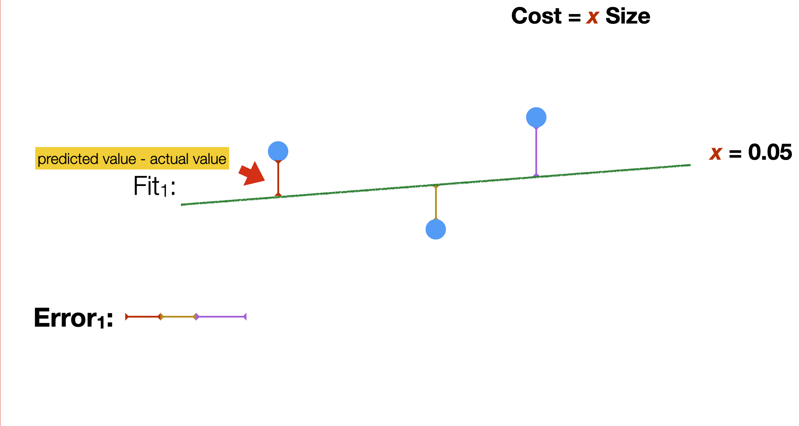
Background: media/true

A common way to measure the quality of a function in fitting a given distribution is by measuring the error made (on average) when using the data distribution. In the example, we do it by calculating the distance (the error) between each point in the training set and the linear function.

---

Background: media/true

Many different lines could fit the simple distribution in the slide. How do we find the best one? 
We calculate the error for every possible slope of the linear function. A person would take a very long time, but this is what computers are for: execute repetitive calculations quickly and tirelessly. 
To guide the process, we need a **cost function** (sometimes called a **loss function**), a formula that allows calculating "how good" a model works.  **Training a model** means finding the parameter values that minimise the cost function

In linear regression, we often use the so-called **Mean Squared Error**, the average of the squared differences between the predicted value and the actual value of a data item. This is a quadratic function that looks like a parabola curve.

---

Background: media/true

In our example, we find that the first slope is the one that better fits the training data. 

What we have been doing here is, in a very simple way, **training** a model based on the available data. The training process has the goal of finding the optimal parameters of the model. In our example, the model has a single parameter *b*.

---

### Finding the best parameter values
	- ==Training the model==

	- **Gradient Descent**: an algorithm to find the minimum point of a function 
	- **Hyper parameters**: parameters of the Gradient Descent
		- *Learning Rate*: speed of descent
		- *Epochs*: max number of steps

To find the best parameter values, we use a very common approach called **Gradient Descent**. Gradient descent is an algorithmic way to find a minimum point in a differentiable function. The gradient descent approach does not require knowledge of the shape of that function but only of its partial derivatives. 

The gradient descent algorithm has two parameters. 
The **learning rate** controls how much the value of the parameters to be estimated changes at every step. The higher the value, the faster will be the “descent.” But also, the higher could be the risk of “jumping” in less optimal points of the curve. The lower the value, the more accurate yet slow the descent. 
The **epochs** that is the maximum number of steps that the algorithm can take before stopping. We need to set a maximum number of epochs because it is possible for the algorithm never to find **THE** optimal value and thus continuously oscillate between close values. 

---

In this example animation, we visually show how the gradient descent algorithm operates. 

The graph on the left shows a dataset, similar to the one in our example. Each blue dot is a data item. The red line represents the linear function for a specific *slope* value. You can observe the line moving upwards as the *slope* value increases. 

The graph on the right has on the *x* axis the value of the parameter *p* to estimate (in our example, the slope *b*), and on the *y* axis the value of the cost function calculated for a specific value of *b*. We saw in a previous slide that the *mean squared error* is a quadratic function that looks like a parabola curve. In the animation, we explore different values of the parameter left to right, from zero to higher numbers. As we move from left to right, the value of the error function decreases, progressively approaching its minimal value - that is, the value of *p* for which the error is minimal. That value, *18* in our animation, is the desired one for our model. 

From this animation, you can appreciate how the **learning rate** and **epochs** parameter allows controlling for the length and precision of this process. For instance, a high learning rate -- that is, increasing too much the *p* value, allows to explore the parameter values quicker, but it could have led to missing the optimal value. 

In the real world, where models have thousands, millions, or billions of parameters, there are several optimisations for the gradient descent algorithm. For instance, the initial values of parameters are either set at random or sampled from an existing data distribution. Likewise, values of learning rate and epochs are determined dynamically, based on the value of the partial derivates of the error function. 

---

Background: media/true

In the previous example, we explored a very simple regressions model;  the data points were just a few, so, the optimization could be done quickly. 

Also, by selecting a linear function, we assumed that the data hold, to some extent, a linear relationship. In many cases, such linear relationships might not hold so we can use more complex models. That is, models with more parameters. 

In the example here, we use a polynomial function. The function still has a single feature (*size*) but several components. This allows for a non-linear model that is “closer” to the data points, thus reducing the error. This is called polynomial regression. 

As we will see later, there are even more complicated models. 

In a model like the one in the slide, what does it mean for a parameter to equal *0*? That the related component **does not contribute** to the prediction -- that is, the value of that particular component does not relate to the output value. Similarly, if a component has a *very high parameter value* (negative or positive), then such a component is very important in predicting the output value.

---

### Classification 

--- 

Background: media/true

Let us now look at the **classification** problem. 

For example, let us take the problem of classifying whether a student will be accepted at a university based on the results of a selection *test* (*x*-axis) and their high-school grades in *mathematics* (*y*-axis). 

For this problem, we are provided with several data points. We have several students for whom we know the values of these two variables (our *feature space*, in this case 2-dimensional) and their admission result (yes/no, our binary *class*). For instance, in the slide, we have two students that were either rejected or accepted based on the two values. 

---

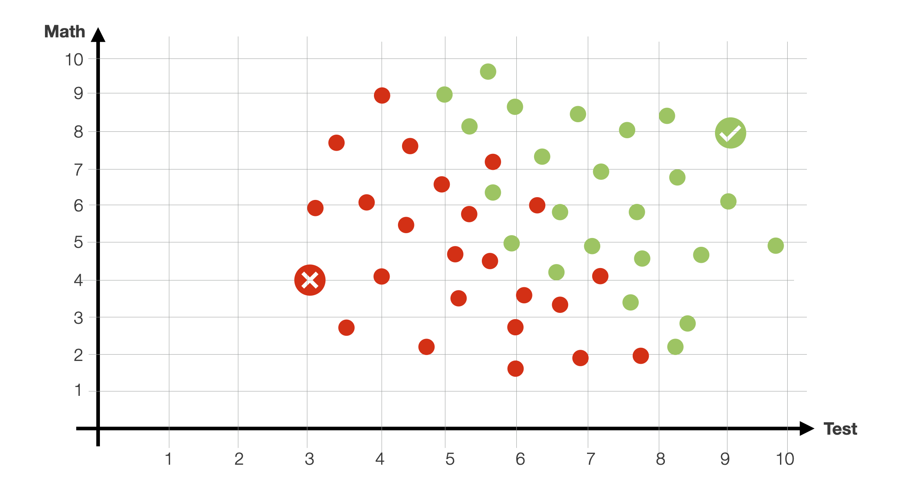
Background: media/true

The dataset is, of course, bigger. Green dots are students that were previously accepted. The red dots are students that were not accepted. As you can see, there isn’t a clear-cut separation in this 2-dimensional feature space. Obviously, high-performing students (high *math* and *test* scores) were accepted, and low-performing students were rejected. However, there are several students "in the middle" for which the relationship between the value of the two features and the outcome (accepted/rejected) is unclear. Some students with a high *test* grades were not accepted due to low *math* grades. And vice versa.

---

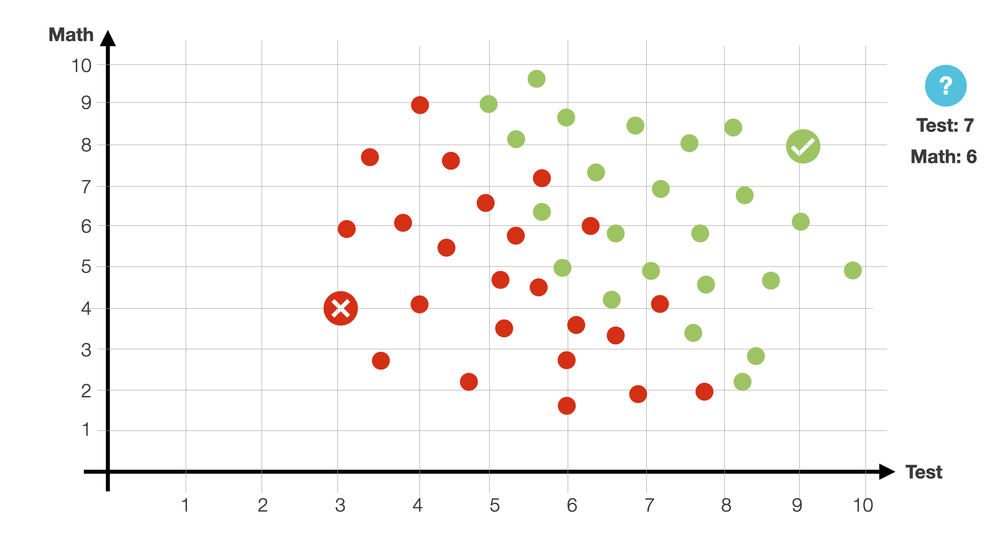
Background: media/true

Let us assume that new students are coming. Given a new student applying at a university (math grade 6) and performing the admission test with a 7. Will the student be accepted?

---

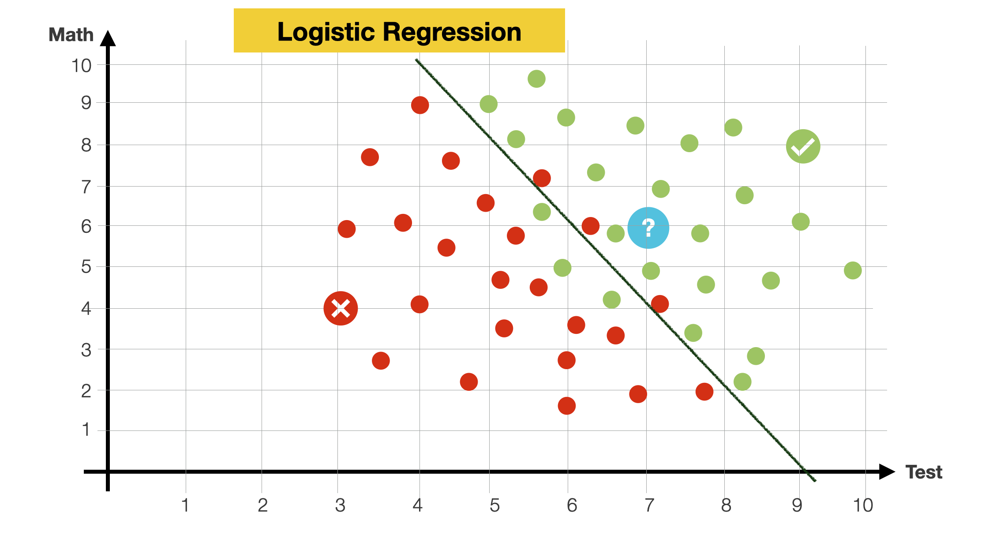
Background: media/true

To answer the question, let’s look at the data. Most of the points seem to be separated by a line. Most points over it are green, and most below it are red, with some exceptions. We will say that that line is our model, so when a new student comes in, if they happen to be above the line, we predict they will be admitted. Otherwise, they won’t.

We have already encountered this method, this is a Logistic  Regression.

How do we find this line that cuts the data in 2?

---

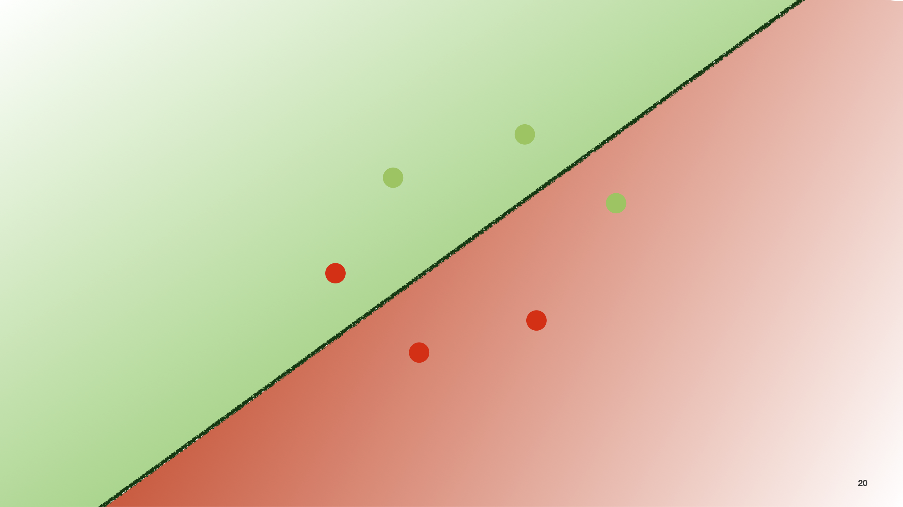
Background: media/true

As before, let me show you an example of how a computer can learn to do this automatically.

Let’s assume we draw a line trying to separate this bi-dimensional space in 2. 

As with the previous linear regression, we want to measure how “good” this model is in fitting the data. In this case, we measure the error slightly differently. This means we use a different **cost function**. 

For instance, we can count how many points are classified incorrectly. In the example here, the number of errors is 2. 
---

Background: media/true

By trying different configurations for this function (that is, different slopes), we can find the one that minimises the number of prediction errors. This can also be done with the gradient descent algorithm. 
---

Background: media/true

In the slide, by moving the line a little bit, the number of errors decreases.

---

Background: media/true

If we move it again, it becomes 0.

Note that in reality, we would not use the number of errors as a cost function, but we use something called **Log-loss** function. 

Here the mathematical formulation becomes a big complex, so we will not indulge further. The intuition beyond this measure is to give a high penalty to items that are misclassified with a high probability (that is, they fall far away from the line), and to give a lower penalty to the ones that are misclassified with low probability (so, they are closer to the line). 

---

Background: media/true

We created the example here to illustrate the problem of finding a **decision boundary**. However, the example is weird, as we data items where students with a very low test score or math scores are still accepted. 

---

Background: media/true

Let us then modify the data a little to make it a bit more realistic. 

---

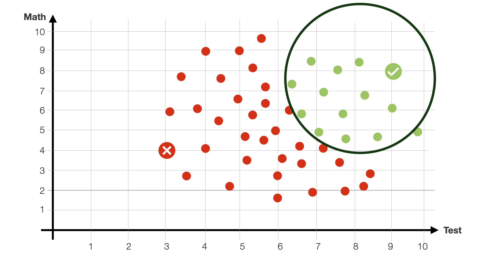
Background: media/true

Notice that with this data, it would be very difficult to define a decision boundary with a single line. We would need something like a circle, a function that is much more difficult to estimate. 

---

Background: media/true

With can also try to train a model composed of multiple functions. For instance, two lines. As before, we can use some gradient descent approach to find the best possible parameters for each of these lines. 

---

Background: media/true

In this example, we are estimating multiple functions at the same time. Each function is estimated separately, yet together, as they contribute to defining the decision boundary. And in practice, this is what a **neural network** does. 

---

Background: media/true

**Neural networks** are one of the most popular (if not the most popular) machine learning models currently used for both *classification* and *regression*.

Neural networks are meant to, in the very broad sense of the word, mimic how the human brain operates. 

The one in the picture is a **deep** neural network, of the ones that you might have heard of or that we have discussed previously. They indeed look scary, but we can simply understand them. 

---

Background: media/true

We call them neural networks because their basic unit, the **perceptron**, vaguely resembles a **neuron**.

A neuron comprises three main parts: the soma, the dendrites, and the axon. In broad terms, the neuron receives signals from other neurons through the dendrites, processes them in the soma, and sends a signal through the axon to be received by other neurons.

A *perceptron* is designed to work similarly to a neutron: it receives *numbers* as inputs, applies a *mathematical operation* to them and outputs a new *number*.

---

Background: media/true

In a *perceptron*, the mathematical operation is typically the weighted sum of the input values plus the bias - a simple weighted linear combination of the input values. 

In this way, we can represent linear functions in feature space of arbitrary size, including the mono-dimensional one of our previous examples with linear regression. Intuitively, a perceptron with a single input (and a bias) is precisely the equivalent of the regression function in our previous example. 

---

Background: media/true

The **activation function** takes the values of the weighted linear combination of the input and decides how the perceptron will *activate* (or *fire*), that is, if it will output a value.  

---

Background: media/true

Many activation functions could be used in a perceptron. We show two. 

The *step* function returns a 1 if the output of the weighted linear combination is nonnegative and a 0 if it is negative.

The *sigmoid* function works slightly differently, as it outputs a number between 0 and 1. The number is close to 1 if the score is positive and close to zero if the score is negative. If the score is zero, then the output is 0.5. Note that a single perceptron using a sigmoid function operates exactly as a linear regression. 

---

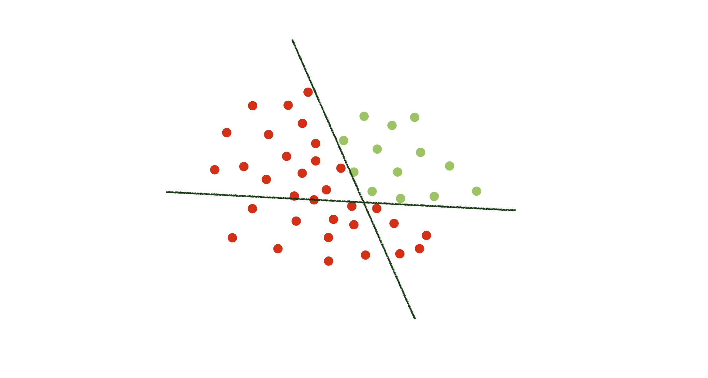
Background: media/true

So, let’s go back to our classification example, where we have two linear functions dividing the two-dimensional space. 

We can split the problem of classifying the data items into two problems - each related to one of the two functions. 

---

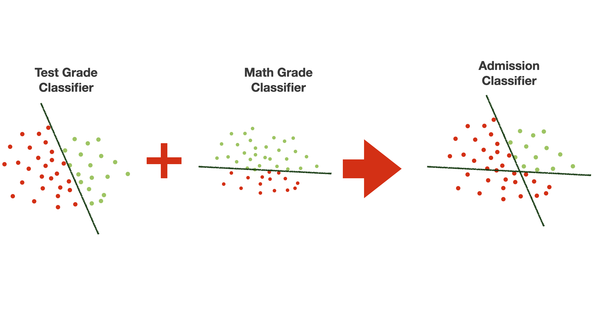
Background: media/true

Let’s say that one function -- we call it **Test Grade Classifier** -- partitions the decision space in one way, while the other function -- we call it **Math Grade Classifier** -- partitions the decision space in the other. Note that we are still using **both** features in each classification. Together, the two classifiers make the **Admission Classifier**. 

---

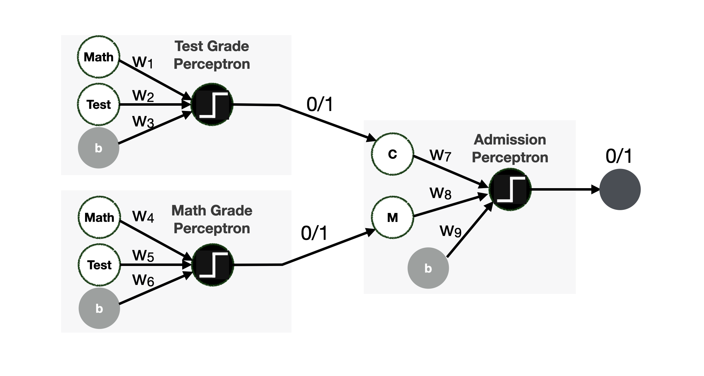
Background: media/true

The situation described in the previous slide can be modelled with the neural network in the picture. It comprises three perceptrons: the **Test Grade Perceptron** and the **Math Grade Perceptron**, both used as input for the **Math* and **Test** features. The **Admission Perceptron** uses the output of the **Test Grade Perceptron** and the **Math Grade Perceptron** as input. The three perceptrons output a $0$ or a $1# value, as they use a **step** activation function. 

---

Background: media/true

Note how different activation functions produce different types of classification boundaries. 
---

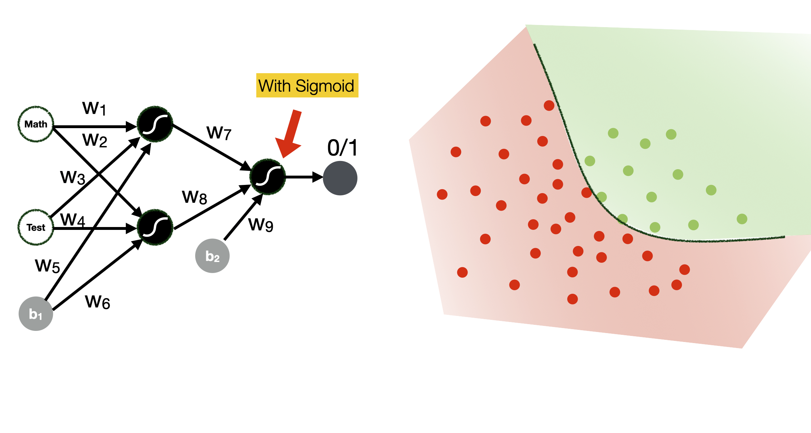
Background: media/true

Here you can see how the use of a sigmoid function can change the boundaries of the classification space.

---

### Fully connected Neural Network
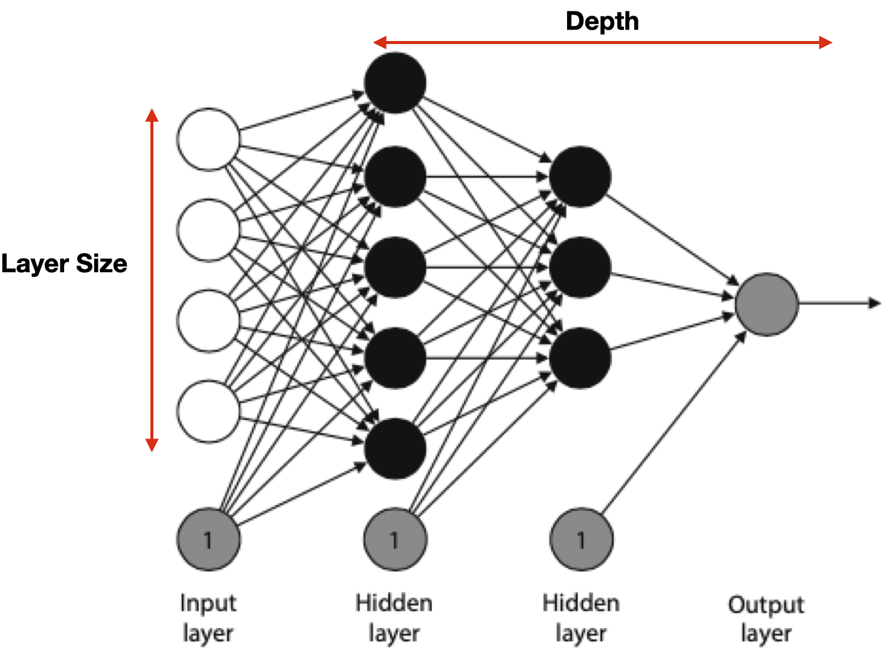

	- **Hyperparameters**
		- Learning rate
		- Number of epochs
		- Architecture
			- #layers, #nodes, activation functions
		- Batch vs. mini-batch vs. stochastic gradient descent 
		- Regularization parameters: 
			- Dropout probability p

So far, we have seen examples of a small neural network. In real life, neural networks are much larger. The nodes are arranged in layers, as illustrated in the slide.

The first layer is the **input layer**, the final layer is the **output layer**, and all the layers in between are called the **hidden layers**. Perceptrons in the same layers are typically similar, i.e., they have the same activation function.

The arrangement of nodes and layers is called the **architecture** of the neural network. The number of layers (excluding the input layer) is called the **depth** of the neural network. The **size** of a layer is the number of non-bias nodes in that layer. Note that neural networks are often drawn *without* the bias nodes, but it is always assumed they are part of the architecture. 

The network in the slide has every node in a layer connected to every (non-bias) node in the next layer. Furthermore, no connections happen between nonconsecutive layers. This architecture is called **fully connected feedforward**. For some applications, we use different architectures where not all the connections are there or where some nodes are connected between non-consecutive layers. We will see some examples in the coming lectures. 

Like most machine learning algorithms, the *training* of a neural network is configurable through *hyper-parameters*. These hyperparameters determine how the training is performed. The first two we saw before:  how long we want the process to go (number of epochs) and at what speed (learning rate). As neural networks are much more powerful models, their training (and performance) are subject to much more fine-tuning. 
For instance, neural networks are not trained by examine **all the data* in the dataset at once but just a subset at a time. 
How these subjects are composed (e.g. size, distribution of data items in the feature space) is a hyper-parameter (Batch vs. mini-batch vs. stochastic gradient descent). Neural networks are also prone to *overfitting* (a concept we will explore in another lecture) -- that is, they have poor generalisation capabilities and learn "too well" the training data distribution. *Regularisation* techniques help by "distracting" the network by introducing noise. For instance, *Dropout* is a training technique where a few perceptrons in the network are *randomly* "switched off" during different training phases. 

---

### Classifying into multiple classes - *Softmax* function

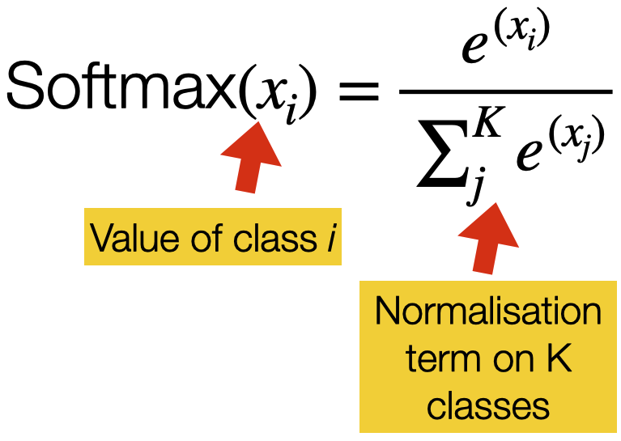

	- Return a probability for each class
		- example C1= ADMITTED, C2 = NOT ADMITTED, C3 = NEW TEST
		- p(C1) = 0.37, p(C2) = 0,21, p(C3) = 0,42
	- We use the *Softmax* activation function for the output layer

Perceptrons return a single numerical value (discrete or continuous). They are, therefore, perfectly suited for *regression* problems, but how can we make them work for classification problems? In that case, instead of returning a $0$ or a $1$ (step function on the output layer), or a value between $0$ and $1$ (sigmoid function on the output layer), we would like to return a **probability** value for each class in the classification problem. In the slide, for instance, we have slightly modified the classification problem by having 3 classes: $C_1$ that means *admitted*, $C_2$ that means *not admitted* and $C_3$ that represents a case when a *new test* is needed. When a new instance is processed, the network should return a probability value (0 and 1) for each class. 

To allow for this situation, we can change the activation function of the output layer into a **Softmax** function. The softmax function is a function that turns a vector of $K$ real values (where $K$ is the number of classes) into a vector of $K$ real values that *sum to 1*. The input values can be positive, negative, zero, or greater than one, but the softmax transforms them into values between 0 and 1, so they can be interpreted as *probabilities*. If one of the inputs is small or negative, the softmax turns it into a small probability, and if an input is large, it turns it into a large probability, but it will always remain between 0 and 1.

The important assumption is that the true class labels are independent. That is to say each sample of data can only belong to one class. For example, a person cannot be *admitted* and not *admitted* simultaneously. Its true label can only belong to one class.

Note that the *sigmoid* activation function is equivalent to the *softmax* function when we there are only two classes. It is unnecessary to calculate the second vector component explicitly because when there are two probabilities, they must sum to 1. So, if we are developing a two-class classifier with logistic regression, we can use the sigmoid function.

---

	[Tensorflow Playground](https://playground.tensorflow.org/)

If you want to experiment with neural networks, and have a better feeling of how they work, I strongly recommend you try the [Tensorflow Playground](https://playground.tensorflow.org/). There you can try different data distributions, classification problems, activation functions, etc. 

[COMMENT]: consider adding something about training (forward and backward propagation) and optimisation. 
---

## Machine Learning and Images

In the first lecture, we defined Computer Vision as the sub-field of Artificial Intelligence and Machine Learning that focuses on 1) extracting high-level understanding from images or videos or 2) generating realistic images and videos. 

---

Background: media/true

To understand why vision is a difficult task for computers to perform, let's start with something relatively obvious: the way we (humans) see is very different from the way computers "see." When presented with an image like the one in the slide, humans can process much information simultaneously. You can look at the picture as a whole, and understand that it depicts an outdoor scene in a park, probably New York City (this is Central Park), where people are Ice Skating, probably in winter. We do all of this instantaneously, almost intuitively, relying both on our intuition and our knowledge. 

---

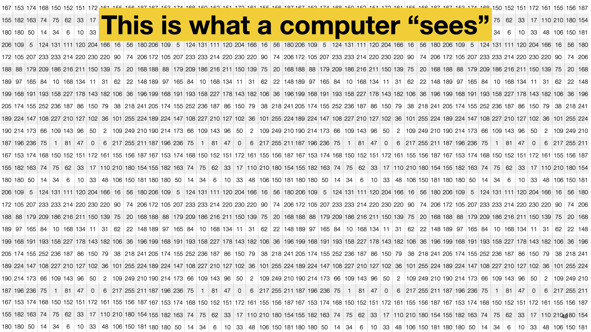
Background: media/true

But this is what a computer "sees"—just an extensive matrix of numerical information. Just numbers. This difference in interpretation is what is commonly referred to as "Semantic Gap". A [semantic gap](https://en.wikipedia.org/wiki/Semantic_gap) "characterises the difference between two descriptions of an object by different ... representations, for instance, languages or symbols".
---

### Images
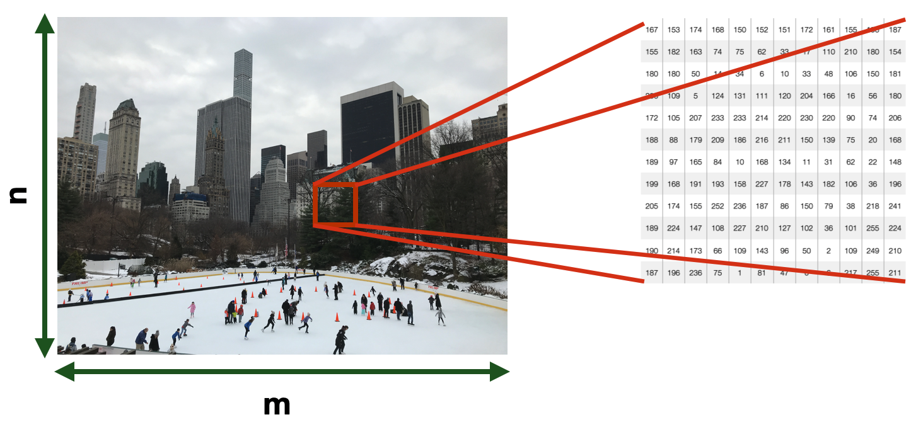

	- Each pixel in an image is a *feature*
		- numerical
			- 0 or 1 for *Black and White*
			- Between 0 and 255 for *greyscale*
			- 16M values for *RGB*
	- Dimensionality -> *n x m*

Images are made of pixels and, in computer vision machine learning models, each pixel is an **input feature*. Depending on the type of the image, each feature (pixel) can assume a different numerical value. 

Pixels in *Black and White* images have a value of either $0$ (black) or $1$ (white). *Grayscale* images have a wider intensity range, so each pixel has a value ranging between 0 (black) and 255 (white). *Color Images* have multiple color channels, represented using different color models (e.g., RGB, LAB, HSV). For example, an image in the RGB model consists of red, green, and blue channels. Each pixel in a channel has intensity values ranging from $0$ and $255$.

---

### Computer Vision
	Building algorithms that can “understand” the content of images and use it for other applications 
	- It is a “Strong AI” problem
		- signal-to-symbol conversion
		- The **semantic gap**

	A general-purpose vision system **requires**
	- Flexible, robust visual representation
		- Updated and maintained 
	- Reasoning
	- Interfacing with attention, goals, and plans

*Computer vision* is about automating and integrating various processes and representations used for visual perception. And this is difficult, very difficult.

Vision requires many capabilities we often take for granted. For instance, the ability to extract intrinsic images of "lightness," "color," and "range." We perceive black as black in a complex scene even when the lighting is such that some black patches reflect more light than some white patches. Similarly, perceived colors are not related simply to the wavelengths of the reflected light; if they were, we would consciously see colors changing with illumination. 

But vision is not only about **sensing**, it is also about **interpreting**, i.e. processing the acquired information to extract meaning from it. In the context of computer vision, the Semantic Gap can be defined as 
“... the lack of coincidence between the information that one can extract from the visual data and the interpretation that the same data have for a user in a given situation.”"[^1]

The human brain solves this in multiple steps in different brain regions. Take, for instance, the ability to *recognise objects*. This ability is acquired either biologically (e.g. recognizing faces), through development (e.g. recognizing different types of vehicles), or through learning (e.g. recognizing a specific type of plane).  

Computer vision is intrinsically tricky because it requires "re-inventing" the most basic yet inaccessible abilities of biological visual systems.

[^1]: Smeulders, A.W., Worring, M., Santini, S., Gupta, A., Jain, R.: Content-based image retrieval at the end of the early years. IEEE Transactions on Pattern Analysis and Machine Intelligence (TPAMI) 22, 1349–1380 (12 2000). https://doi.org/10.1109/34.895972 
 
---

### What specific tasks can we train a CV system to perform?

Due to all these complexities, it is not possible to implement a vision system that can emulate the human one. What recent advances in machine learning allowed, however, is the ability to perform *specific vision tasks*, in predefined contexts, with very good performance. We will now see several examples. 

---

Background: media/true

In an image, drawing a *bounding box* around a specific object is called **object localization**. Object localization means recognizing the existence of one or more objects (of any type) in an image and marking the location with a bounding box. 

**Object recognition** (or object **classification**) is the ability to *both locate and classify* objects in an image. Given an image, the object recognition tasks produce in output *one or more* multiple bounding boxes. Each bounding box marks the objects’ location and class.

---

Background: media/true

Current CV technology can recognize hundreds (or more) of objects at the same time. It is possible, for instance, to use object recognition to *count* the number of people in a given area (e.g., for crowd control purposes).  

---

It is possible to do so also in real-time, in live video streams. The examples in the picture use a popular CV technique called Yolo (see a recent implementation [here](https://github.com/mikel-brostrom/yolov8_tracking).
---

Background: media/true

*Face detection* has been used for multiple years in cameras to take better pictures and focus on faces. Smile detection can allow a camera to take pictures automatically when the subject is smiling. 

---

Background: media/true

*Face identification* is more difficult than *face detection*, as the goal is not to recognize *any face*, but to *identify* the person having a specific face. 

---

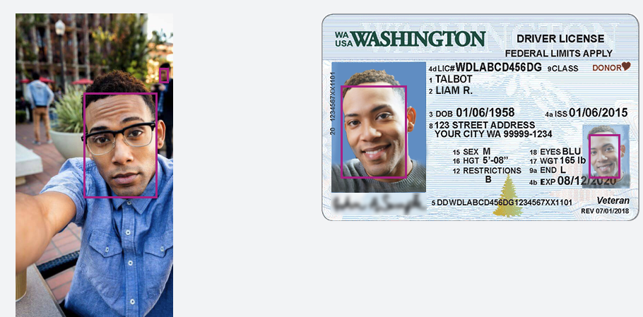

In the past, this task could have been performed only by security services and large organisations (e.g. airports). Today, thanks to the availability of large collections of high-quality labeled data (e.g. your personally curated photo albums on Google Images or Apple Photos, or Facebook), achieving extremely good performance on very large populations is possible. For the same reason, face identification can also be used for biometric identification. 

---

The identification task can also be performed on specific objects in the real world. 

---

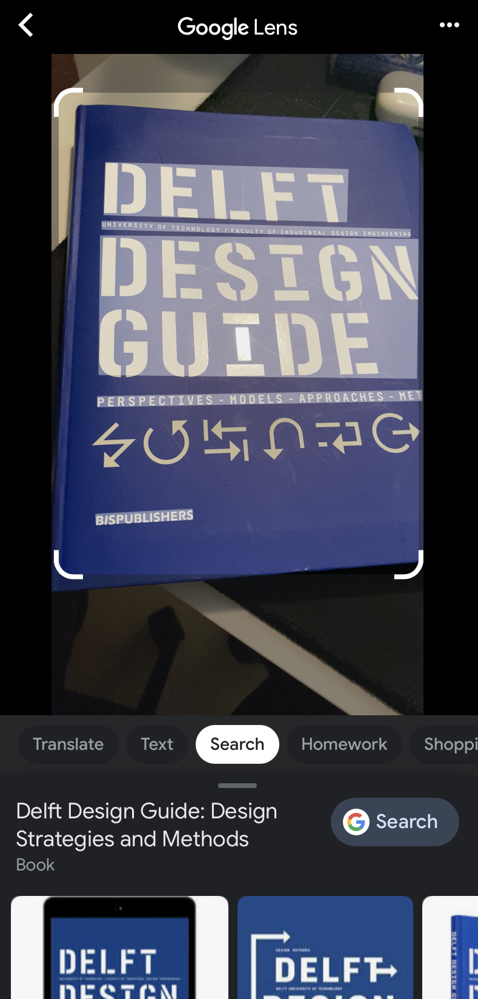

Applications like [Google Lens](https://lens.google) allow one to identify monuments, landmarks, books, plants, and other object classes. 

---

Background: media/true

The **image segmentation** task is devoted to the **partitioning** of a digital image into multiple **image segments** (sets of pixels), also known as *image regions*, each containing a defined object class. Image segmentation is the **assigning a label to every pixel in an image**, aiming to simplify the representation of an image into something more meaningful and easier to analyze.

---

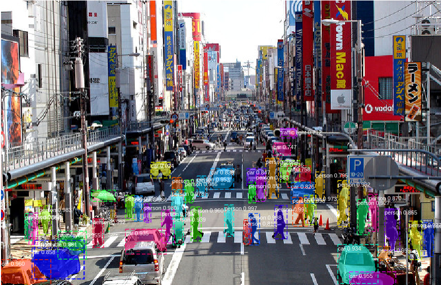

Image segmentation is very important for all those CV applications where detecting an object's contours (boundaries) is essential. Imagine, for instance, self-driving cars. Or medical imaging applications where the goal is to locate tumors, or measure tissue size/volume. 

---
	[Project Sunroof](https://www.google.com/get/sunroof)

An example of use of image segmentation that I like is [Project Sunroof](https://sunroof.withgoogle.com). In that application, image segmentation has been used to delineate roofs from satellite images to estimate solar exposure for PV installations. 

---

Background: media/true

**Scene categorization** is a task in which scenes from photographs are categorically classified. Unlike object classification, which focuses on classifying prominent objects in the foreground, Scene recognition involves a different set of challenges from those posed by object recognition. Like objects, scenes are composed of parts, but whereas objects have strong constraints on their parts distribution, scene elements are governed by much weaker spatial constraints. 

---

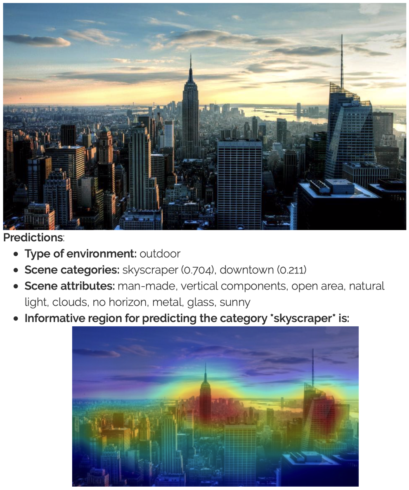

An example of dataset (and scene recognition algorithm) is the [MIT Places](http://places2.csail.mit.edu) dataset. The dataset contains more than 10 million images comprising 400+ unique scene categories at a different level of semantic resolution. For instance, there are the classes *forest - broadleaf*, *forest path*, *forest road*; *garage indoor* and *garage outdoor* and so on. 

---

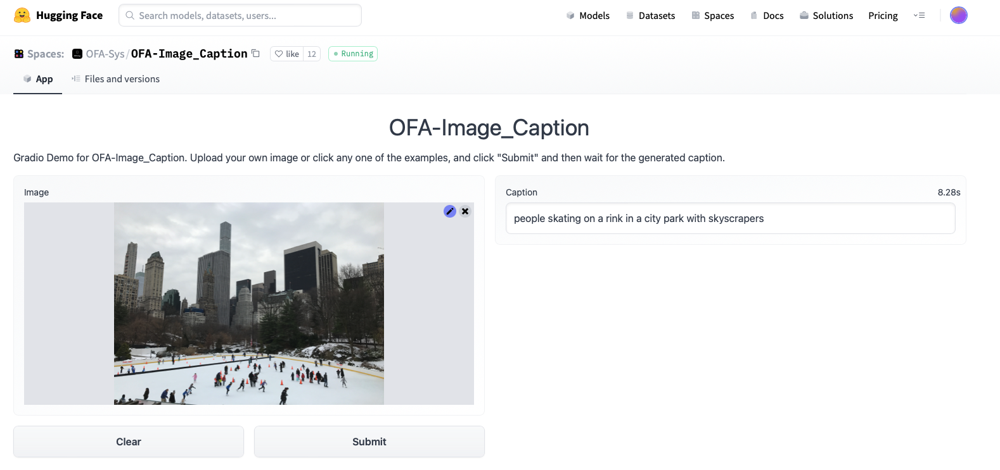
Background: media/true

You can try an example of scene recognition algorithm yourself, on HuggingFace.

---

Background: media/true

**Human Activity Recognition** is the problem of identifying events performed by humans given a video input. It is formulated as a binary (or multiclass) classification problem of outputting activity class labels. Activity Recognition is an important problem with many societal applications including smart surveillance, video search/retrieval, intelligent robots, and other monitoring systems [^1].

[^1]: https://paperswithcode.com/task/activity-recognition

---

Background: media/true

While activity recognition is commonly performed by wearable devices (by analysing accelerometer and other data) in computer vision **pose estimation* is a common way to classify activities. 

In **Pose Estimation**, the goal is to detect the position and orientation of a person. Usually, this is done by predicting the location of specific key points like hands, head, elbows, and knees. 
 
---

Background: media/true

This video, created in the context of the master thesis [Ethical task tracking of operators in agile manufacturing](
http://resolver.tudelft.nl/uuid:3408e8c3-809b-436d-94eb-efb4f0532b17) shows an example of how pose estimation can be used to track the actions of workers in a production plant, to support them with knowledge about their currently executed tasks, 

---

#### Stereolabs ZED Camera
	[3D Object Detection](https://www.stereolabs.com/docs/object-detection/)
	[Body tracking](https://www.stereolabs.com/docs/body-tracking/)
	Positional tracking

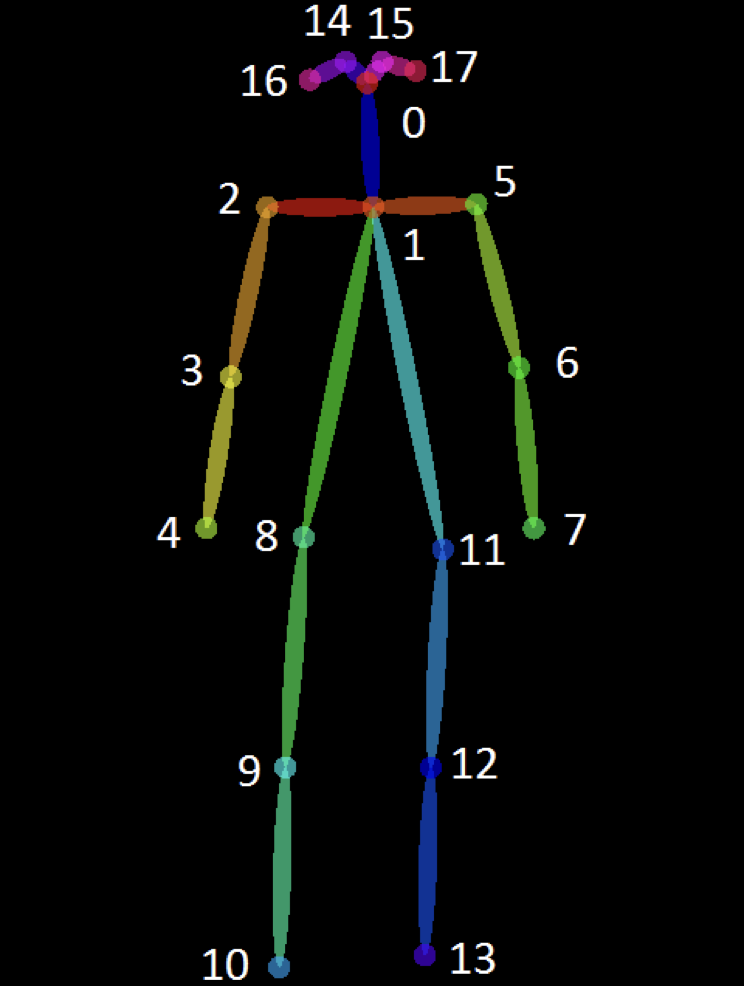

This technology is commonly and readily available. The [Stereolab ZED 2 camera](https://www.stereolabs.com/zed-2/) offers an integrated solution that could be easily deployed and adapted to specific application domains. 

---

Background: media/true

The list of computer vision applications can be **very** long. I recommend you explore the examples in [this page](https://viso.ai/applications/computer-vision-applications/), classified according to application domains. 

---
#### Credits
	[CMU Computer Vision](http://16385.courses.cs.cmu.edu/spring2022/) course - Matthew O’Toole. 
	Grokking Machine Learning. Luis G. Serrano. Manning, 2021

