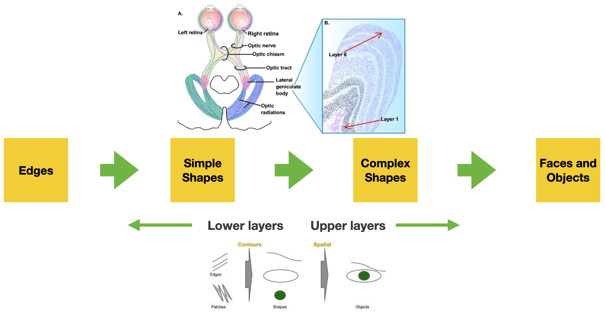
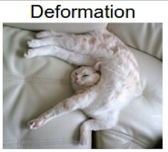
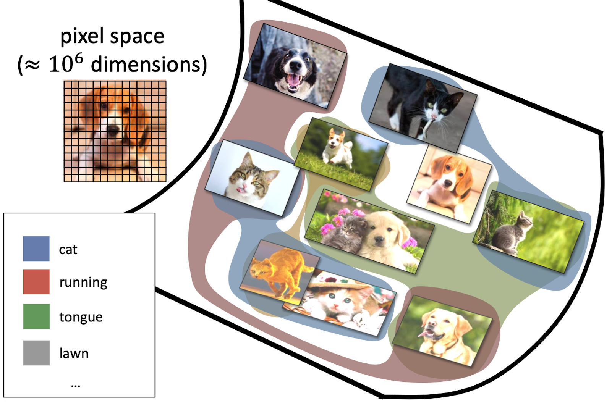
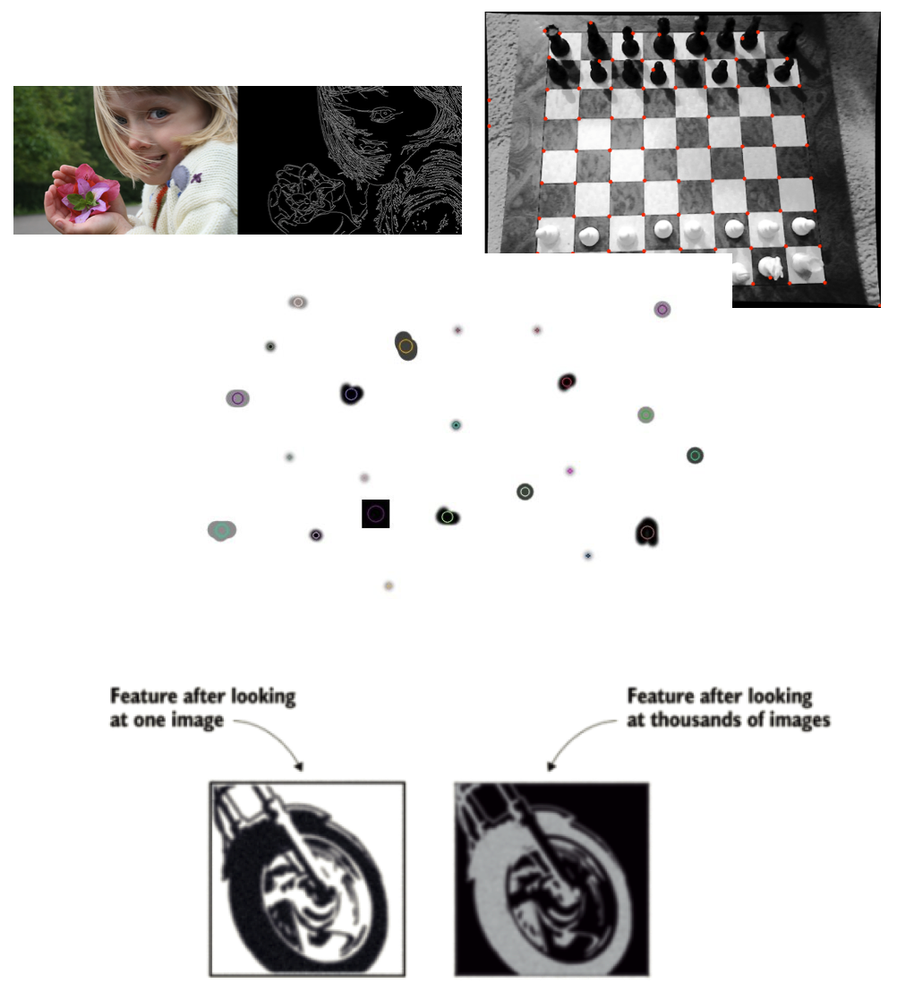
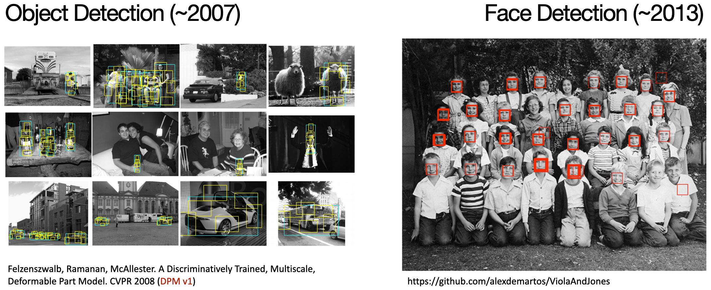
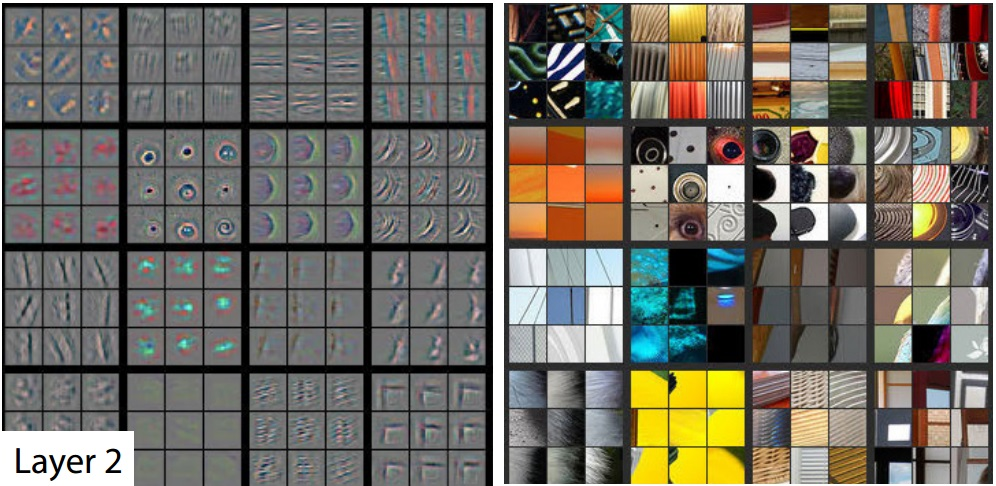
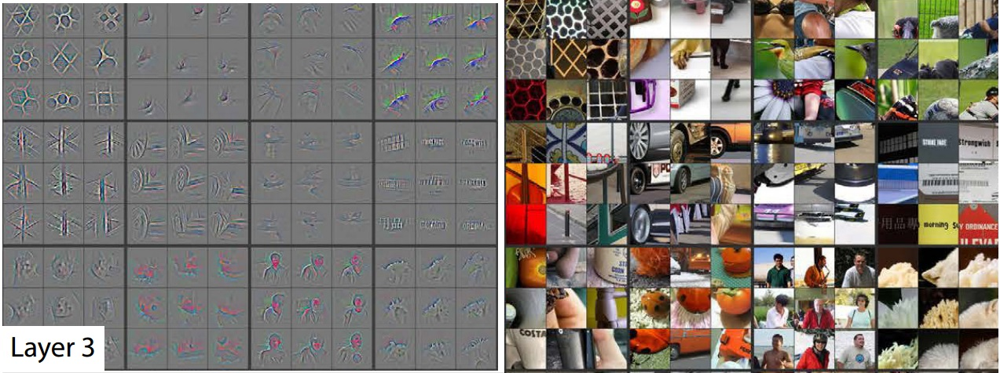
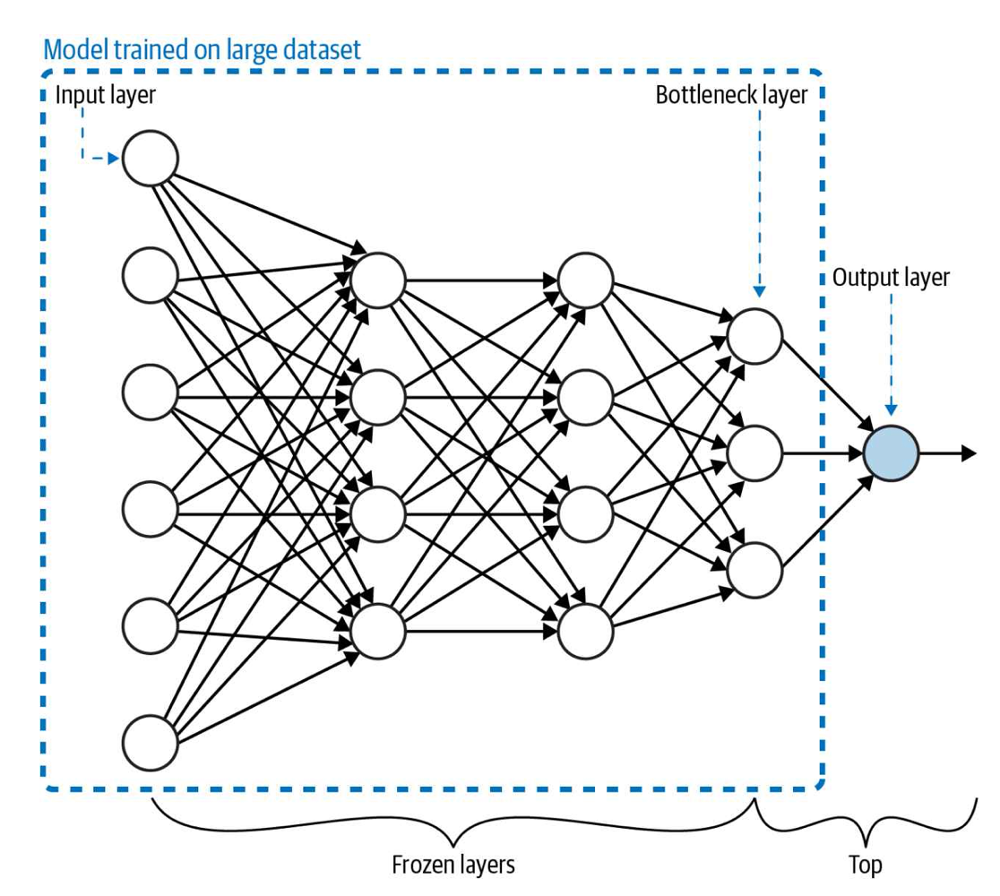
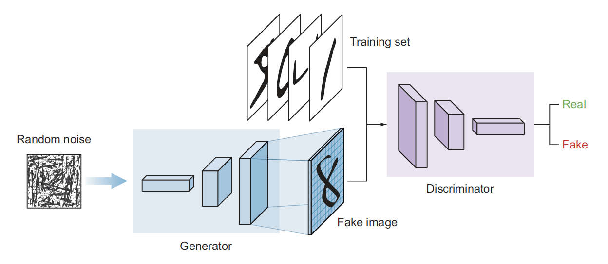

# Lecture 4: Lecture Notes

Version 1.0
Date: 12/03/2023
Author: Alessandro Bozzon

---

## How do humans see?

Vision is one of the ways humans perceive the world. At its most basic, visual perception is observing patterns and objects through sight or visual input. Visual perception relates visual input to a previously existing *understanding* of the world, as constructed through previous experience and learning.  Over 50 percent of the processing in the human brain is dedicated to visual information. This fact alone should give a good feeling of how difficult it is to replicate biological vision with a computer. Computer vision has not been solved in 50 years and is still a tough problem. 

---

	### Hubel and Wiesel, 1959

In 1962, Hubel & Wiesel[^1 David H Hubel and Torsten N Wiesel. Receptive fields, binocular interaction and functional architecture in the cat’s visual cortex. The Journal of Physiology, 160(1):106–154, 1962] set up an experiment to study the optical system of a cat. They recorded neurons while showing bright lines to a "wired" cat. They found that some specialized neurons fired only when the line was in a particular spot on the retina or if it had a specific orientation. If you open [this video](https://www.youtube.com/watch?v=IOHayh06LJ4) and turn up your volume, you can listen to the neuronal activity of the cat's visual cortex.

The experiments by Hubel and Wiesel are cornerstones of our understanding of how neurons along the visual pathway extract increasingly complex information to construct an image. Their research spearheaded a discipline devoted to understanding the human visual system's workings. And in 1981, they were awarded the Nobel Prize in Physiology and Medicine for their work. 

---

### Neural Pathways

Picture from https://nba.uth.tmc.edu/neuroscience/m/s2/chapter15.html

Vision systems are the same for humans, animals, insects, and most living organisms at the highest level. A visual system is built of two fundamental components. A **sensing device** - your eyes, and an **interpreting device**, your brain. 

The eye captures the light coming through the *iris* and projects it to the *retina*. The retina contains specialized light-sensitive receptors that convert the image into spatially distributed neural activity in the first neurons of the visual pathway. Stimulus features (e.g., color, brightness contrast, movement) are processed (in parallel) at all levels of the visual system and recomposed by the simultaneous activation of large areas of the visual cortex, which resides at the back of your head. The visual cortex is roughly organized as a hierarchical series of *layers* where the neurons in each layer communicate their activations to neurons in the next layer. 
Through their experiments, Hubel and Wiesel discovered that neurons in different layers act as *detectors* that respond to increasingly complex features appearing in the visual scene: neurons at initial layers become active in response to *edges*; their activation feeds into layers of neurons that respond to *simple shapes* made up of these edges, and so on.

Note that as the complexity of the recognized patterns grows, different brain regions (the **interpreting device**) to get activated to associate **meaning** to the visual information and connect it to one's knowledge and understanding of the world.  

This is a relatively simplified description of how the visual system works. An important note: in reality, the visual system does not only have *feed-forward* pathways - i.e., flow of information from the eye to the brain. There are also many more (ten times more) *feed-backward* connections - from the brain to the lower layers -  whose role is not well understood by neuroscientists. The current hypothesis is that our prior knowledge and expectations about the world, as stored in higher brain layers, can strongly influence our perceptions. The sentence "seeing what we want to see" might have a literal meaning. 

---

### Neural Correlation
#### of Objects & Scene Recognition

The slides' pictures show how different brain areas get "activated" based on the visual stimuli shown - for instance, a face, an object, or a scene. 

Hubel and Wiesel’s discoveries inspired a Japanese engineer named Kunihiko Fukushima, who in the 1970s developed one of the earliest deep neural networks, dubbed the *cognitron*, and its successor, the *neocognitron*.

---

## Why is machine vision hard?

---

### The deformable and truncated cat

---

Background: media/true

What’s so hard about computer vision? Scientists (a long time ago) believed that vision would be an easy problem to solve. There’s this famous AI [memo](https://dspace.mit.edu/handle/1721.1/6125) from Seymour Papert, who, in 1966, proposed a summer vision research project with interns to solve computer vision for a few months. He severely underestimated the task at hand.

Consider the problem of getting a computer program to *recognize* cats in photographs. 

Suppose the input is simply the pixels of the image. In that case, the program first has to figure out which are “cat” pixels -- that is, pixels that contain visual information about the cat -- and which are “non-cat” pixels, that is, pixels having information about the background, shadows, or other objects. 

However, cats are fascinating creatures, aren't they? They look very different: they can have diverse coloring, shapes, and sizes. This means the pixels associated with "cats" may vary greatly from image to image. When taking a picture of them, cats can face in various directions; the lighting can vary considerably between images; parts of the cat can be blocked by other objects (for example, fences and people). Cats are deformable [^1 [The Truth About Cats and Dogs](https://www.robots.ox.ac.uk/~vgg/publications/2011/Parkhi11/parkhi11.pdf)]
Moreover, “cat pixels” might look like “dog pixels” or other animals. Under some lighting conditions, a cloud in the sky might even look very much like a cat. 

---

Background: media/true

All these representational variations make the problem of recognizing objects in computer vision very difficult. The image in the slide comes from a now classic paper [Strike (with) a Pose: Neural Networks Are Easily Fooled by Strange Poses of Familiar Objects](https://arxiv.org/pdf/1811.11553.pdf). As the title entails, the paper shows how non-canonical poses of ordinary objects can easily fool a neural network. 

---
### Computer Vision Challenges

The following slides summarise and explain some of the main challenges computer vision systems must address. Note that all of these challenges are present **simultaneously**. Solving one might not necessarily help solve all the others. 

---

#### Viewpoint Variation
	A single instance of an object can be oriented in many ways to the camera.

Let us take, as an example, the task of recognizing objects in an image. Depending on the viewpoint, the 2D representation of a 3D object might dramatically change, despite this being the same object. Depending on the viewpoint, the pixels change dramatically.

---

#### Deformation

	Many objects of interest are not rigid bodies and can be deformed in extreme ways.

The same is true for *deformation*. Many objects (and animals, like cats) are not rigid. This means that they can be deformed in ways that, when captured in a picture, will create collections of pixels that are entirely unique. 

---

#### Occlusion

	The objects of interest can be occluded. Sometimes only a tiny portion of an object (as few pixels) could be visible.

Sometimes only a relatively small portion of an object can be visible. For instance, because it is cost out of the image or because it is *occluded* by another object. In the picture, the cat is occluded by a wall.  

---

#### Illumination Condition
	The effects of illumination can be drastic on the pixel level.

Look at the pictures in the slide, can you recognize what they show? The scene is the same but illuminated by different lights. Depending on where the light is projected, our understanding of the scene changes dramatically, as the organization of the pixels in the image. But it is precisely the same scene, pictured under the same viewpoint. This is to show an intricate interplay between materials and light that give rise to many different images despite showing precisely the same scene.

---

#### Scale variation
	- Visual classes often exhibit variation in their size
		- Size in the real world
		- Size in the image

Variations of the size of the object to be recognized also matter. Objects of the same class in the real world can have different sizes - there are small and big cats, various sizes of autos, etc. However, also the size of an object in the image matters. Small things in images are captured by fewer pixels. This means there is less visual information to use when recognizing them. 

---

#### Background clutter

	 The objects of interest may blend into their environment, making them hard to identify.

The recognition of an object in an image can be made more difficult by "visual distractions," that is, the background or elements of the image, such as patterns, textures, colors, shapes, or other objects that are visually similar to the object of interest or that overlap with it in some way.

---

#### Intra-class variation
	 - The classes of interest can often be relatively broad, such as chairs. 
	 - There are many different types of these objects, each with their appearance.

Finally, a big challenge is a variation in the object itself. Despite having the same nature or functionality, objects within the same class (e.g., cats, dogs, chairs, tables) might look very different. To distinguish a cat from a dog, for instance, a computer vision system has to be able to solve the problem that despite many cats looking different, they are part of the same category. We call this the *intra-class variation* (*intra = within*) problem.  
Of course, there is also an issue with the sheer number of object categories that exist in the world -- it is estimated that there are between *ten thousand* to *thirty thousand* high-level object categories. Of course, the number immediately increases when the categorization becomes more fine-grained. [ImageNet](https://www.image-net.org/), a popular computer vision dataset, contains over 20,000 categories, with a typical category consisting of several hundred images. 

---

## How Computer Vision models work?

Images are made of pixels, and, in computer vision machine learning models, the more straightforward approach is to use the pixel values directly **input features*. 

Here we need to take a small diversion and introduce the concept of *similarity* in a representation space; and the *manifold hypothesis*, an essential assumption at the basis of machine learning research. 

*Similarity* refers to the degree of resemblance or closeness between two objects or data points in a given feature space. Intuitively, this could be described with the idea that "cat pictures" have similar pixels distribution because cats look similar. We saw in the previous section that this might not be the case; however, with enough pictures of diverse enough cats (in diverse enough lighting conditions, etc.), a fundamental assumption in machine learning is that it is possible to create a "decision boundary" that identifies cats in that feature space. Whether this assumption is realistic depends, of course, on the amount, diversity, and quality of the available training data. 

One of the characteristics of high dimensional data (e.g., images in a dataset) is that the number of dimensions is comparable to, or larger than, the number of samples. The *Manifold Hypothesis* states that real-world high-dimensional data lie on low-dimensional manifolds embedded within the high-dimensional space. The hypothesis is based on the idea that high-dimensional data is often redundant (i.e., not all the dimensions used to represent a data item contain helpful information), and only a few underlying factors or features determine the structure and patterns in the data. Due to the manifold hypothesis, many data sets that appear to initially require many variables to describe can be described by a comparatively small number of variables. The Manifold Hypothesis explains why machine learning techniques can find useful features and produce accurate predictions from datasets that have a potentially large number of dimensions (variables). The fact that the actual data set of interest lives on in a space of low dimension means that a given machine learning model only needs to learn to focus on a few key features of the dataset to make decisions. 

---

### Course of dimensionality
	- High dimensionality
		- A 1024×768 image has d = 786432! 
		- A tiny 32×32 image has d = 1024
	- Decision boundaries in pixel space are extremely complex
	 - We will need “big” ML models with lots of parameters 
		- For example, linear regressors need   d parameters

The number of pixels (hence, the number of features) can become too big for a machine-learning model. Presume you have a 1MB image, where each pixel is represented by a single byte (0..255 value). At 1MB, you have one million pixels. That would require an input vector of 1,000,000 elements. Assuming that the input layer has 1024 nodes, there will be over a billion (1 million x 1024) weights to learn, just in the input layer! This number increases drastically when we have tens or hundreds of layers. Even if, in the news, you can read of ML models with 200 or 300 billion parameters, this is a number that cannot be easily handled. 

Therefore, the first step after preprocessing the image is to simplify the image by 1) reducing its color complexity (e.g., transforming it into black and white); 2) resizing the image to make it smaller; 3)  extracting the vital information (features) and throwing away non-essential information. Each one of these techniques can be applied in conjunction. Modern ML techniques based on deep learning only require resizing the images, keeping color information, and not requiring feature extraction. 

---

### Downsampling

**Downsampling** reduces the resolution of an image to make it more tractable from a computational perspective. It is common in CV applications to reduce images to 1024x1024 resolution or even 512x512. 

Downsampling allows for faster learning and processing time, but it also comes at a disadvantage. By reducing the image resolution too much, it is possible to lose the ability to distinguish what's in the image.  

---

### Flattening

In computer vision applications, we deal with images or video. A picture can be represented as a 2-dimensional matrix, a grid of pixels. 

However, machine learning approaches typically deal with input data organized in arrays (sets or lists) of features. For instance, the input layer of a Neural Network is an array of numerical values of size $d$. 

**Flattening** is placing each row of the image matrix in sequential order into a vector. So the vector starts with the first row of pixels, followed by the second row of pixels, and continues by ending with the last row of pixels. 

This simple transformation has a significant consequence: *any spatial relationship between the pixels is lost*! This means that contiguous pixels in the array might not have the same contiguity in the original image. As we will see, modern computer vision techniques can overcome this slight but essential distortion introduced by a mere technical requirement. 

Note that flattening is not **always** used as the first step in a machine-learning approach. As we will see later, Convolutional Neural Networks allow for keeping the matrix format of an image and even retaining color information. The feature flattening happens later in the network.

---

### The “old days”: Feature Extraction
	- **Feature**
		- A relevant piece of information about the content of an image
		-e.g., edges, corners, blobs (regions), ridges
	- **A ==good== feature** 
		- Repeatable
		- Identifiable
		- Can be easily tracked and compared
		- Consistent across different scales, lighting conditions, and viewing angles
		- Visible in noisy images or when only part of an object is visible
		- Can distinguish objects from one another

A *feature* in machine learning is an individual measurable property or characteristic of an observed phenomenon. Features are the input you feed to your machine learning model to output a prediction or classification. Selecting good features that clearly distinguish your objects increases the predictive power of machine learning algorithms.

In computer vision, a feature is a measurable piece of data in your image that is unique to that specific object. A CV feature is a group of connected pixels with some common property. It may be a distinct color or a particular shape, such as a line, edge, or image segment. 

Features are helpful to "compress" information. The input image has too much extra information that is unnecessary for classification. Therefore, the first step after preprocessing the image is simplifying it by extracting the important information and throwing away nonessential information. By extracting, for instance,  important colors or image segments, complex and large image data can be transformed into smaller sets of features. This makes classifying images based on their features simpler and faster.

A good feature is used to distinguish objects from one another. For example, if we consider a feature like a *wheel*. Clearly, that feature is more likely to be associated with the class "motorcycle" than the class "dog". A *wheel* is a strong *identifiable* feature that clearly distinguishes between motorcycles and dogs. However, the same feature will probably not be strong (*identifiable*) enough to distinguish a bike from a bicycle. For that purpose, more features are needed, like a mirror, license plate, or maybe a pedal. 

A good feature is also *repeatable*, i.e., it should be useful to represent a class of objects, not a single one. For instance, the visual representation of a *wheel* should not be a single image's exact copy of a wheel. Still, it should be generic enough to represent many motorcycle wheels (see the image at the bottom). So, it should look like a circular shape with some patterns that identify wheels in all images in the training dataset. 

Good features should also be easy to *compute*, to *track* and *compare*. If a feature is complex to calculate or very brittle to compare, it will probably not be very useful to the machine learning model. 

Finally, an idea feature is also *consistent* across different conditions (sales, lights, viewing angle) and *robust* to noise and occlusions. 

---

### The “old days”: Feature Engineering
	- Machine learning models are only as good as the features you provide
	- To figure out which features you should use for a specific problem
	 - Rely on domain knowledge (or partner with domain experts) 
	 - Experiment to create features that make machine learning algorithms work better

Before the era of deep neural networks, computer vision required spending a lot of time in manual feature selection and engineering. 

**Feature engineering** relates to manipulating and transforming data into a format that optimally represents the underlying problem that an ML algorithm tries to model and mitigates inherent complexities and biases within the data.

In this process, the ML engineer relied on domain knowledge -- potentially partnering up with domain experts -- to create features that make ML algorithms work better. 

The features are in specific locations of the images, such as mountain peaks, building corners, doorways, or interestingly shaped patches of snow. These kinds of localized features are often called *keypoint features* (or even corners) and are often described by the appearance of patches of pixels surrounding the point location. The features that can be matched based on their orientation and local appearance (edge profiles) are called *edges*. They can also indicate object boundaries and occlusion events in the image sequence.

These features are used as input to machine learning algorithms like (fully connected) neural networks or random forests for classification, that is, to learn the correlation between such features and the prediction class. 

---

### Feature Extraction Techniques 

In this course, it is impossible to cover the whole field of features engineering for computer vision - there is literature going back thirty years. I will, however, describe some examples. 

**Histograms of oriented gradients** (HOGs) is an example of a feature extraction technique commonly used for object recognition tasks. HOG focuses on the object's shape in the image by attempting to quantify the gradient (or magnitude) and the orientation (or direction) of the edges of an object. HOG calculates gradients and orientations in broken-down, localized regions of the image and calculates a histogram of gradients and orientations to determine the final feature values. 

Another technique is the **Scale Invariant Feature Transform** or SIFT. The SIFT descriptor is invariant to translations, rotations, and scaling transformations. It is also robust to moderate perspective transformations and illumination variations. 

---

### Performance

Credits: Ross Girshick (Facebook AI Research)

Feature engineering and "old" style feature extraction techniques have been the foundation of computer vision for many years. And while advancements were consistent, they never reached a level of performance that allowed for wide-scale applications. 

Convolutional Neural Networks changed everything. 

---

### Convolutional Neural Networks

	- CNNs exploit image properties to reduce the number of model parameters drastically
	- Feature maps
		- Automatically extracted hierarchical 
		- Retain spatial association between pixels
	- Local interactions
		- all processing happens within tiny image windows
		- within each layer, far-away pixels cannot influence nearby pixels
	- Translation invariance
		- a dog is a dog even if its image is shifted by a few pixels

Convolutional Neural Networks (CNN) drive today’s deep-learning revolution in computer vision and other areas. CNNs were first proposed in the 1980s by the French computer scientist Yann LeCun, inspired by Fukushima’s neocognitron. The design of CNN is based on several critical insights about the brain’s visual system discovered by Hubel and Wiesel. 

CNNs allow for eliminating Feature Engineering, as the network can be used for feature learning and classification.

ConvNet consists of a sequence of layers of perceptrons. Perceptrons in each layer provide input to perceptrons in the next layer. Like the neural network, when a ConvNet processes an image, each perceptron takes on a particular activation value. This number is computed from the unit’s inputs and their weights. Weights are randomly initiated and learned during network training. The difference between a fully connected neural network and a CNN is the use **convolutional layers** instead of regular fully connected layers for feature- learning. 

A **convolutional layer** is the core building block of a convolutional neural network. Convolutional layers act like a *feature finder* window that slides over the image pixel by pixel to extract meaningful features that identify the objects in the image. 

Layers are *locally connected*. This means that nodes in the layer are connected to only a small subset of the previous layers’ nodes - for instance, pixels in the input image. This way, filters are applied only on close-by pixels without being influenced by far-away ones. This allows filters to focus more, preserve local spatial relationships, and reduce the overall computational cost. 

A **feature map** is the output of one filter applied to the previous layer. It is called a feature map because it maps where a specific feature is found in the image. CNNs look for features such as *straight lines*, *edges*, or even objects in the deeper layers. Whenever they spot these features, they report them to the feature map. 

CNNs allow for *translation invariance* for images fed through the network. This means the network can recognize patterns (or shapes) that are shifted or slightly warped within images.

Notice that the image dimensions shrink after each layer, and the number of feature maps (the layer depth) increases. Conceptually, you can think of this set of consecutive convolutional layers as the neural network learning to represent more abstract features of the original image.

The output of the feature extraction step is then flattened to a vector of the learned features of the image. Notice that the image dimensions shrink after each layer, and the number of feature maps (the layer depth) increases until we have a long array of small features in the last layer of the feature-extraction part. 
The flattened feature vector is fed to the fully connected layers (a traditional fully-connected neural network) to classify the extracted features of the image.

---

### Convolution & Feature Maps

Each convolutional layer contains one or more **convolutional filters**. The number of filters in each convolutional layer determines the depth of the next layer because each filter produces its feature map (convolved image). 

In mathematics, *convolution* is the operation of two functions to produce a third modified function. In the context of CNNs, the first function is the input image, and the second is the convolutional filter. In the slides figure (left), the convolutional filter (also called a **kernel**) is the 3x3 matrix that, by sliding over the input image, breaks the image into little chunks and processes those chunks individually to assemble the modified image, a **feature map** (right). 

Not that in CNNs, convolution matrixes are **the weights**. This means the network learns its values during training. 

Try this: https://cs.stanford.edu/people/karpathy/convnetjs/demo/mnist.html

---

### What CNNs learn?
	[Deep Visualization Toolbox](https://www.youtube.com/watch?v=AgkfIQ4IGaM)

Watch this [video](https://yosinski.com/deepvis). 

---

### Feature Visualisation

In the following slides and pictures, we will give an impression of what a CNN learns through its convolutional layers.

---

#### Layer 1

For instance, the first layer of the CNN consists of edge-detecting units. This picture is taken from the paper: *Visualizing and Understanding Convolutional Network. Zeiler and Fergus, ECCV 2014*. 

---

#### Layer 2

The second layer can recognize more complex patterns and shapes.  

---

#### Layer 3

While the third layer can now capture the visual representation of more "abstract" concepts, like faces or wheels. 

---

### Network Dissection

This image is taken from the [Network Dissection](http://netdissect.csail.mit.edu) dataset and related papers. It shows how specific concepts are "learned" by different CNN architectures. 

---

### Translation Invariance

	 But not rotation and scaling invariance!

Remember, CNN allows for *translation* invariance. They can recognize features (e.g., a wheel) even if it appears in different positions of an image. They are, however, **not** *rotation or scaling invariant*. Objects that are rotated or scaled w.r.t. their representation in the training data might not be recognized. 

---

### What about generalisation?

As we often repeated, one of the main challenges in ML is to give the model the ability to *generalize* beyond the training data. However, what could be done if a CNN (or any network architecture) does not offer rotation or translation invariance? 

The answer is in **data augmentation techniques**. 

---

### Data Augmentation

	- Generate variations of the input data
		- To improve generalisability (out-of-distribution inputs)
		- Improve invariance (rotation, scaling, distortion)

Data augmentation means expanding the training dataset with modified versions of the current images. Scaling, flipping, rotations, and other affine transformations are typically used to enlarge your dataset and expose the neural network to various variations of the training images. Alternatively, *color space augmentations* (photometric transformations), random cropping, or noise injection allow the network to be more robust and makes it more likely that your model will recognize objects when they appear in any form and shape.

---

### Data Augmentation

	- Geometric
		- Flipping, Cropping, Rotation, Translation, 
	- Noise Injection
	- Color space transformation
	- Mixing Images
	- Random erasing
	- Adversarial training
	- GAN-based image generation

A good survey on state-of-the-art data augmentation techniques is: [A survey on Image Data Augmentation for Deep Learning. Shorten, Journal of Big Data, 2019](https://journalofbigdata.springeropen.com/articles/10.1186/s40537-019-0197-0).

---

### Robustness to input variation

Let's keep in mind that, despite all these attempts to extend the training datasets through data augmentations, computer vision models like CNN are still very brittle to variations of objects (and their representation) in images. The paper [Strike (with) a Pose: Neural Networks Are Easily Fooled by Strange Poses of Familiar Objects. Alcorn et al. 2019.](https://arxiv.org/pdf/1811.11553.pdf) describes this problem, although I encourage you to try using a tool like Teachable Machine. 

---

### Transfer Learning

	- **Problem**: training custom ML models requires huge datasets
	- **Transfer learning**: take a model trained on the same data type for a similar task and apply it to a specialised task using our custom data. 
		- **Same data**: same data modality. same types of images (e.g., professional pictures vs. Social media pictures)
		- **Similar tasks**: if you need a new object classification model, use a model pre-trained for object classification

Transfer learning is one of the most important techniques that emerged from modern deep learning. Building a vision system to solve a specific problem requires collecting and label a vast amount of data to train your network. But what if this is not possible? 

Transfer learning is the transfer of the knowledge (*feature maps*) that the network has acquired from one task, where we have a large amount of data, to a new task where data is unavailable or available only in small quantity. 
The idea behind transfer learning is to utilize the weights and layers from a model trained in the same domain as your prediction task. Intuitively, all images must have shapes and edges, so the early layers are usually transferable between domains.

In most deep learning models, the final (fully connected) layer contains the classification label or output specific to a prediction task. With transfer learning, the last layers are removed to keep only the learned features that could be effectively transferred across tasks. However, the transferability of features depends on the similarity of the training and new datasets. This is especially true for later layers: the deeper the network layers, the more image-specific the learned features. For instance, imagine the task of recognizing objects in medieval paintings. An object recognition network trained on modern images (e.g., from Flick) would probably not be helpful, as bikes and cars (and their parts) were perhaps unavailable in medieval times. However, the earlier layers of the network -- the ones recognising edges and shapes -- are undoubtedly helpful, as any object shares the same geometry set. 

At training time, the preserved model’s trained weights are frozen, and the final layer (the fully connected classification one) is replaced with a specialized prediction task output. The new network can then be trained, and only the last weights (the ones of the classifier plus any other unfrozen layer) are learned. 

Transfer learning is also frequently applied in image object detection, image style transfer, image generation, text classification, machine translation, and more. Transfer learning works because it allows to utilization of models already trained on extremely large, labeled datasets. 

---

## Advanced Computer Vision Techniques

---

### Generative Adversarial Networks

	- Learn patterns from the training dataset and create new images that have a similar distribution of the training set
	- Two deep neural networks that compete with each other
		- The **generator** tries to convert random noise into observations that look as if they have been sampled from the original dataset
		- The **discriminator** tries to predict whether an observation comes from the original dataset or is one of the generator’s forgeries

Generative adversarial network (GAN) is a class of deep learning models [invented in 2014](https://arxiv.org/pdf/1406.2661.pdf) by Ian Goodfellow. This architecture is inspired by game theory. Two models, a **generator** and a **discriminator**, are competing while making each other stronger simultaneously.

GANs have shown remarkable results in many generative tasks to replicate real-world rich content such as images, human language, and music. GANs can also be used in text-to-photo synthesis, image-to-image translation, image super-resolution, and many other applications.

---

	- The **generator**’s architecture looks like an inverted CNN that starts with a narrow input and is upsampled a few times until it reaches the desired size

	- The **discriminator**
	’s model is a typical classification neural network that aims to classify images generated by the generator as real or fake

The **generator** attempts to generate real-looking images, whereas the **discriminator** is a classifier whose job is to separate authentic images from fake ones. The generator creates images using an architecture that resembles a reversed CNN. Starting from a vector of random noise, it creates an image. 
During the training process, the discriminator is provided with authentic images (from the training set) and fake images generated by the generator. The two networks train together until the discriminator can be "fooled" by the quality of the images created by the generator. The images that are created in the end are pretty realistic-looking. Note that these images are new, never seen before, and imaginary. 

---

### [Which face is real?](https://www.whichfaceisreal.com/)

To give an example of how good GANs can be, try this [online "game"](https://thispersondoesnotexist.com/). Can you recognize which face is real? 

---

### Image super-resolution GAN

	- [A good technical summary](https://blog.paperspace.com/image-super-resolution/)

Image Super-Resolution refers to enhancing an image's resolution from low resolution (LR) to high (HR). Thanks to generative technology, using an existing image at the input and using the network to generate new visually compatible pixels is possible. For instance, to enlarge it. Or to fix it. 

---

	- ML-generated painting sold for $432,500
	- The network trained on a dataset of 15,000 portraits painted between the fourteenth and twentieth centuries
	- Network “learned” the style and generated a new painting

GANs can also be used to learn the "style" of a specific set of paintings and to generate new ones in that style. An [image generated by a GAN](https://en.wikipedia.org/wiki/Edmond_de_Belamy) has been sold for good money. 

---

### Neural Style Transfer

Neural style transfer transfers the style from one image to another. It consists of an optimization technique used to take two images: 1) a content image and 2) a style reference image, such as an artwork by a famous painter. Neural style transfer blends them, so the output image looks like the content image but is “painted” in the style reference image style. 

---

This is an example of style transfer applied on the portrait picture of Keanu Reeves. You can try yourself using this [API endpoint](https://replicate.com/rinongal/stylegan-nada).

---

### Text-To-Image Generation

A **text-to-image** model is an example of a generative ML model where the input is a **text prompt**, and the output is an image *matching* the text.

The ML systems learn (in a supervised way) from the text–image pairs how people describe images, their content, and their styles, or, the other way around, how visual concepts/scenes are textually described. These systems demonstrated exciting capabilities. Not only to create "realistic" artworks in a particular style but also, for instance, to create new versions of animals and objects, combining unrelated concepts in plausible ways. 

Credits: [https://github.com/CompVis/latent-diffusion](https://github.com/CompVis/latent-diffusion)

---

	#### ==Design==

	#### ==Computer Science==

This is an example of two images generated from the prompt *A dream of a classroom full of interested XXX students. Realistic, matte painting, HQ, 4k*. In one image, we prompted **design students**and **computer science students** in the other. Observing how the model has learned the association between visual concepts and text in almost stereotypical ways is intriguing. Computer science students are depicted with many screens, with a blue-ish illumination. Design students seem to have post-its on their desks and work in a better-lighted room. 

You can try to generate images using the [Dreamstudio.ai](https://beta.dreamstudio.ai/dream) tools. I recommend you look at the [prompt guide](https://beta.dreamstudio.ai/prompt-guide) to understand how text prompts can be formulated and how they lead to different results. 

---

The architecture of latent diffusion model. (Image source: [Rombach & Blattmann, et al. 2022](https://arxiv.org/abs/2112.01075)

The previous examples are not generated through GANS, but through a different approach called *Diffusion Models*

Standard *Diffusion Models* rely on Markov chains (a statistical model) and operate with two major processes: the *Forward Diffusion* takes an image and gradually corrupts it by introducing noise until it becomes utterly random noise. The *Reverse Diffusion* process Markov Chains recover the data by gradually removing the predicted noise at each time step. The idea is that, in this way, the model learns how to "fill the visual gaps", thus generating images that are close to the ones given for training. A **Conditioning** module lets the network associate visual properties with textual descriptions. The conditioning module contains textual representations (e.g., captions or longer text) associated with the images used for training. The image generation is *conditioned* to respond to a particular textual prompt; therefore, when a user specifies a new prompt, the network generates an image "similar" to the ones associated with the text in the prompt. 

If you are interested, [this blog post](https://waxy.org/2022/08/exploring-12-million-of-the-images-used-to-train-stable-diffusions-image-generator/) describes the images used in the training of [*Stable Diffusion*](https://stability.ai/blog/stable-diffusion-public-release). [These are](https://laion-aesthetic.datasette.io/laion-aesthetic-6pls/images?_search=%22frida+kahlo%22&_sort=rowid) for instance, images related to "Frida Kahlo."

You may wonder: how is it possible to train a model that, based on millions of images, can still create realistic images? How can (visual) information not be lost in the process? The reason is simple: **natural images are not random**. They have high regularity. A face follows a specific spatial relationship between the eyes, nose, cheek, and mouth. In other words, the high dimensionality of images is *artifactual* and the manifold hypothesis described in the previous lecture seems to hold, at least in the case of image processing. 

Diffusion Models have shown incredible performance in many generative tasks, such as image generation, image synthesis, image substitution, and super-resolution. 
They overcome several limitations of GAN models, for instance, the ability to diversify their output more and not to "fixate" on some specific properties of the training sets (mainly because they can best preserve the semantic structure of the data). Diffusion Models are highly computationally demanding, and their training requires huge memory and generates an enormous carbon footprint. For instance, the estimated emissions generated by training a *Stable Diffusion v1* are 11250kg CO2 equivalent ([calculated using the Machine Learning Impact calculator](https://huggingface.co/CompVis/stable-diffusion-v1-4)). This amount is the [equivalent of](https://www.epa.gov/energy/greenhouse-gas-equivalencies-calculator#results) 2.5 gasoline-powered passenger vehicles driven for one year. 

New methods have been proposed to make the process much faster, but they are still slower and more computationally expensive than GANs.

---

### Image-to-Image Generation

Video from: [https://github.com/CompVis/latent-diffusion](https://github.com/CompVis/latent-diffusion).

This video shows several examples of the application of diffusion models. For instance, the generation of realistic images given as input a simple sketch. Or substituting parts of a picture (a technique called "Inpainting"). Or super-resolution. 

---

### Synthetic Video Generation

	Generated from [Synthesia.io](https://www.synthesia.io)

To conclude this quick overview of advanced computer vision capabilities, let me show you a video I have created on the [Synthesia.io](https://www.synthesia.io). Combining several techniques makes it possible today to generate realistic videos (like the one in the slide) simply by selecting an avatar, and providing some text to speak. It is, of course, also possible to create an avatar of yourself or anyone. This capability opens an excellent design space of possibilities. 

These techniques yield considerable potential in the animation and movie industry. Classical techniques require
tedious 3D model creation and manual editing. Machine Learning could automate this process and enable richer
editing, or updating scenes without re-shooting them.

---

### Deep Fakes
	[Very realistic Tom Cruise Deepfake](https://www.youtube.com/watch?v=iyiOVUbsPcM)

But these techniques also raise many concerns. 
**Deepfakes** (a term coined by combining *Deep Learning* and *fake*) are a form of synthesized media that can be created to simulate the presence of a real person in a media.  You can imagine this technology's risks in our current era of widespread online misinformation and deep polarisation. 

---

# Machine Learning for Design
## Lecture 4
### Machine Learning for Images. *Part 2*

Version 1.0
Date: 12/03/2023
Author: Alessandro Bozzon

---
#### Credits
	[CMU Computer Vision](http://16385.courses.cs.cmu.edu/spring2022/) course - Matthew O’Toole. 
	Grokking Machine Learning. Luis G. Serrano. Manning, 2021
	[[CIS 419/519 Applied Machine Learning]](https://www.seas.upenn.edu/~cis519/spring2020/). Eric Eaton, Dinesh Jayaraman. 
	Deep Learning Patterns and Practices - Andrew Ferlitsch, Maanning, 2021
	Machine Learning Design Patterns - Lakshmanan, Robinson, Munn, 2020
	Deep Learning for Vision Systems. Mohamed Elgendy. Manning, 2020

