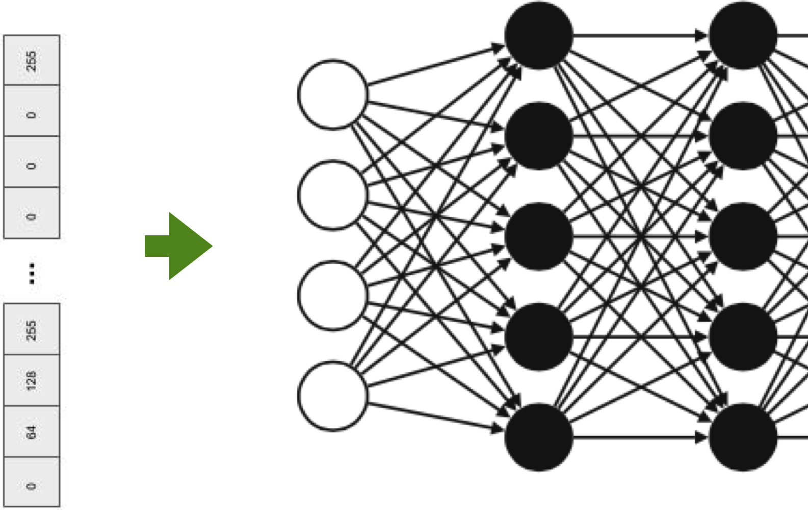
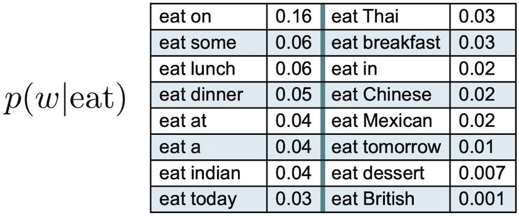
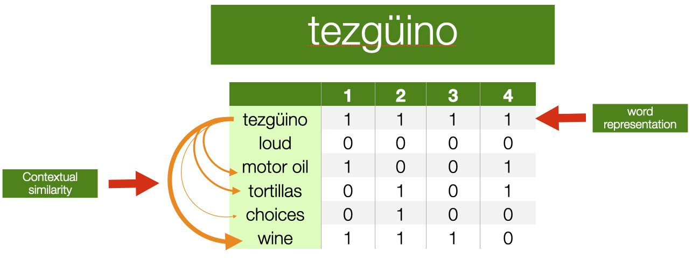
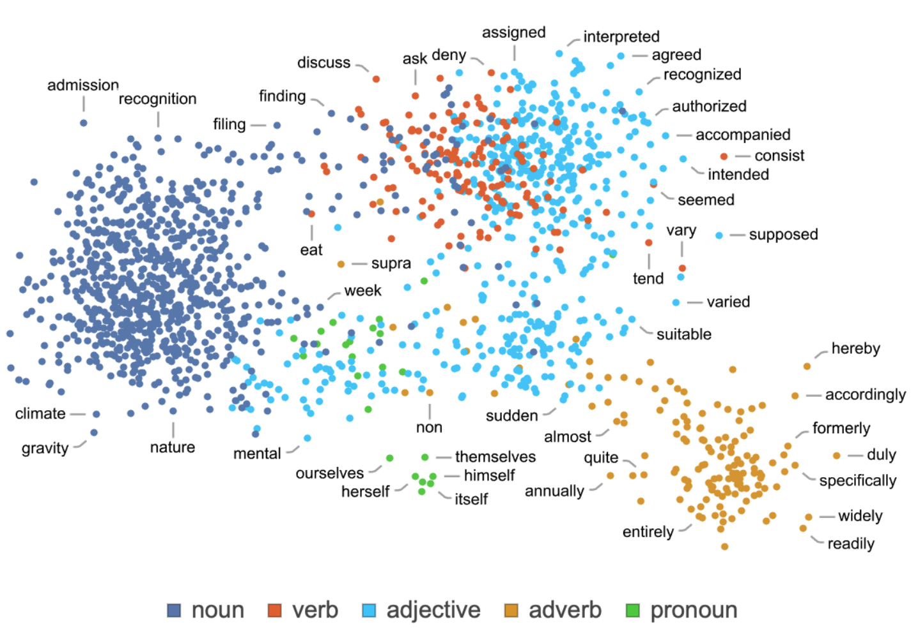
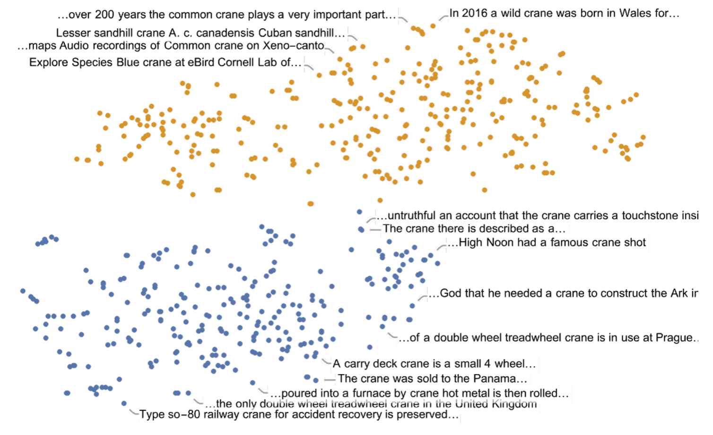
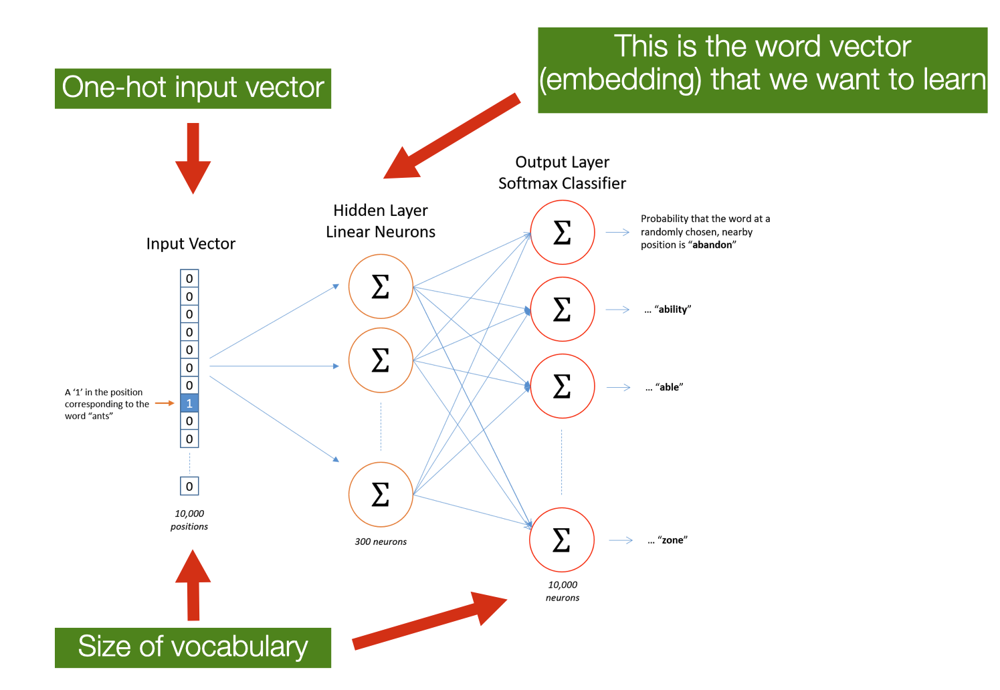
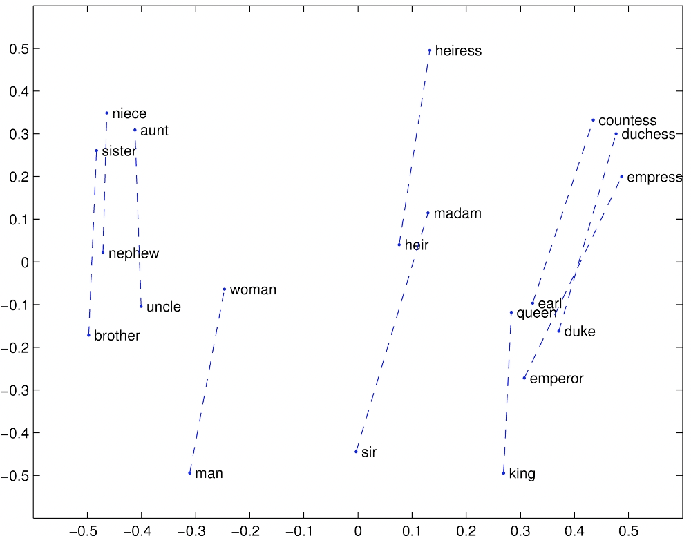
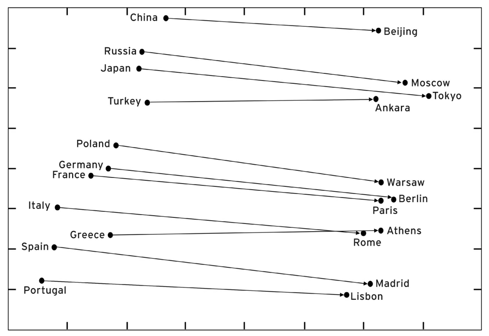

# Lecture 5b: Natural Language Processing - Part 2. Lecture Notes

Version 0.8
Date: 29/03/2023
Author: Alessandro Bozzon

---

## Previously on ML4D

---

	- **Machine Learning**: Observe *pattern of features* and attempt to imitate it in some way

	- A feature is an individual measurable property or characteristic of a phenomenon
	- Choosing informative, discriminating, and independent features is essential for a well-working ML
	- Features
		- Images —> pixel values (e.g. B/W, RGB)
		- Numbers —> OK
	- ==What about **text?**==

In previous lectures of the course, when discussing ML tasks, we discussed how *feature selection* is an essential pre-condition for successful ML models. We have seen how features could be canonically represented using a table, where rows are documents and columns are *numerical features*. We have discussed how in computer vision *pixels* can (and are) used as features, as each pixel contains one or more numerical values. But what about textual documents? What constitutes a feature in Natural Language Processing?

---

## Textual Documents
	- A sequence of alphanumerical characters
		- Short: e.g. tweets
		- Long: e.g Web documents, interview transcripts 

	 - Features are (set of) words
		- Words are also syntactically and semantically organised
	- *Feature values* are (sets of) words occurrences
	- *Dimensionality* —> at least dictionary size 

Textual documents can be represented in multiple ways. One approach, common in the so-called *symbolic approaches*, is to treat words as symbols organized in a so-called syntax tree. Another approach called *bag-of-words* or *n-gram*, common in machine-learning systems, is to represent text as *sparse structured data* by counting in documents the occurrence of individual words, pairs of words, triplets of words, etc. 

---

For example, consider the funny amazon review from the left. It is possible to conceptualize a document collection as a big table where rows are documents, and features (columns) are terms in the collection vocabulary; that is, every single word is a potential feature for a document. The presence or absence of a term in a document is represented by a $0$ or $1$ value. This representation is also called *term-document matrix*. 

---

## Main types of NLP Tasks

	- **Label** (*classify*) a region of text
		- e.g. part-of-speech tagging, sentiment classification, or named-entity recognition
	- **Link** two or more regions of text
		- e.g. *coreference*
			- are two mentions of a real-world thing (e.g. a person, place) in fact referencing the same real-world thing?
	- **Fill in** missing information (missing words) based on context

As we already discussed in the previous lecture, NLP tasks seek to do one of three things: 
- **label** a region of text: this is the case for tasks such as *part-of-speech tagging*, *sentiment classification*, or *named-entity recognition*; 
- **link** two or more regions of text: this is common in *coreference* tasks, where the goal is to assess whether to named entities in a document refer to the same real-world entity (e.g., same person, place, or some other named entity)
-**fill in** missing information (missing words): this is the case for generative models (e.g., GPT) trained on the task of **predicting the most likely next word* based on context. 

In this lecture, we will learn what Language Models are, how they work, and how they can be used. 

---

## Language Representation 
	==Language== = vocabulary and its usage in a specific context captured by textual data

Let us further explore how language could be represented in machine learning systems. An important disclaimer: from now on, by *language* we mean the **vocabulary** (collection of words) and its usage in a specific context captured by textual documents. This is to distinguish our interpretation of the word *language* from the commonly used interpretation - to refer, for instance, to the *Dutch* language.  

---

### What is a ==language model==?
	- A collection of statistics learned over a particular language
	- Almost always empirically derived from a text corpora

"Language Model": two words that have become very popular recently due to the success of generative models like GPT. But what is a language model? Technically, a language model is a statistical model that gives a value (probability) to the likelihood for a piece of text to appear in a sentence. 

Consider you are given the following sentence: “My weekend in Lax has been ruined by bad *___*.” What words are most likely to come next? There could be many reasons for a fantastic winter sports weekend to be ruined: rude people, traffic issues, or bad food. Of course, words like *food* and *people* can appear in this content, but we can agree that the most likely word to appear in the sentence is "weather." 

We just estimated the probability of occurrence for several words in this English sentence. We compared these words based on our personal experience with language and life. We tapped into our *repository* of memories and experiences to calculate the statistical probability of several words and picked the most likely one. 

This is, in essence, the nature of a language model: a collection of statistics learned (mostly empirically - i.e., through observations) on a text corpora. By being empirically derived, language models are not necessarily able to "generalize" their beliefs beyond the observed text collection. A language model trained on a collection of English novels might not have statistics for Italian words. Likewise, it would assign higher probabilities to sequences of words (sentences) that "make more sense," that are more grammatical in English. 

---

### What are language models used for? 

	- **Measure** how *important* (or descriptive) a word is in a given document collection
		e.g., find the set of words that best describe multiple clusters (see Assignment 2) 
	- **Predict** how *likely* a sequence of words is to occur in a given context 
		e.g., find the words that are more likely to occur next

What is the utility of keeping statistics about the likelihood of a word appearing in the given context? It turns out this is an essential feature in many applications of NLP. For instance: 
- To **measure** the importance of words in a document collection
- To **predict** the likelihood of a sequence of words appearing. This is useful in many applications, such as: 
  - **machine translation**, converting a text from a source to a target language.
  - **speech recognition**, converting from an audio signal to text - the presence of noise makes it very useful to know which word is most likely next.
  - Text **summarization**, converting a long text into a short one.
  - Text **generation**, creating new text from an initial input. 

---

### What is the issue with word representation? 

A previous slide showed how textual content could be represented in feature space using a simple *term-document* matrix. That is a representation that is very useful in several contexts. But let us know explore more in details the issue with the representation of words. 

---

	- Words are **discrete symbols**
		- Machine-learning algorithms cannot process symbolic information as it is
		- We need to transform the text into **numbers**
	- But we also need a way to express **relationships** between words!

The first and arguably most important common denominator across all NLP tasks is how we represent words as input to any of our models. To perform well on most NLP tasks, two requirements must be satisfied: 
- Words (discrete symbols) must be represented in a way a computer can process -- typically numbers. Neural networks are pure mathematical computation models that can only deal with numbers. They can’t do symbolic operations such as concatenating two strings and conjugating a verb to past tense unless they are all represented by numbers and arithmetic operations. 
- There must be some notion of **similarity** and **difference** between words to allow comparison and, possibly, some other form of calculation. 
---

### A simple approach 
	- Assign an incremental number to each word
		- $cat = 1$
		- $dog = 2$
		- $pizza = 3$

	- **Problem**: there is no notion of similarity 
		- Is a *cat* as semantically close (similar) to a *dog* as a *dog* is to a *pizza* 
	- Also, no arithmetic operations
		- Does it make sense to calculate $dog - cat$ to establish similarity?

A possible approach to numerically represent all words in a vocabulary is to assign an incremental number to individual terms, as in the slide. 
While numbers now represent words, it does not mean that it is possible to perform arithmetic operations on them. These numbers are discrete and arbitrary (for instance, numbers can be assigned incrementally based on the alphabetical order of words). Clearly, it makes no sense to infer that “cat” is equally similar to “dog” (difference between 1 and 2), as “dog” is to “pizza” (difference between 2 and 3). 

---

### Word Embeddings
	- **Embed** (&represent&) words in a numerical n-dimensional space
	- Essential for using machine learning approaches to solve NLP tasks
		- They bridge the symbolic (discrete) world of words with the numerical (continuous) world of machine learning models

What if words were to be represented on a numerical scale? Not a simple discrete list of numbers (integers) but a potentially n-dimensional space of continuous values. An array (a vector) of *float* numbers. 

A **word embedding** is a continuous vector representation of a word. Word embeddings are a way to represent each word with arrays of arbitrary size filled with nonzero float numbers. The name *embedding* derives from each discrete word being "embedded" in a continuous vector space.

Of course, a question immediately arises: how large should this vector be? 

---

#### Approach 1
	Assign numbers to words, and put semantically related words close to each other

	- We can now express that $dog$ is more related to $cat$ than to $pizza$
	- But is $pizza$ more related to $dog$ than to $cat$?

The slide shows a 1-dimensional vector. It is now possible to represent that “cat” and “dog” are more similar to each other than to “pizza.” Still, “pizza” is slightly closer to “dog” than it is to “cat,” a fact that does not register with our intuition. What if you wanted to place "pizza" somewhere that is equally far from “cat” and “dog?” A single dimension is not possible, so perhaps we need more. 

---

#### Approach 2
	Assign multiple numbers (a vector) to words

	$cat~~~~= [4,2]$
	$dog~~~~= [3,3]$
	$pizza~=[1,1]$
	- We can calculate *distance* (and *similarity*)
		- e.g. Euclidean, or Cosine (angles)
	- But **what is the meaning of an axis**?

In this representation, we achieve that goal. Using a 2-dimensional space and these specific values, we reach the purpose of positioning "cat" and "dog" close to each other but also equally distant to "pizza." This is better, but other questions immediately arise. For instance, how many axes should there be? And how to calculate the numerical value of each word? An arbitrary assignment of numbers to terms doesn’t capture any relationships among words.

---

### One-Hot Encoding
	- Each word in the vocabulary is represented by a one-bit position in a HUGE (**sparse**) vector
		- Vector dimension = size of the dictionary
		- There are an estimated 13 million tokens for the English language 
	
	$cat~~~~~ = [0,0,0,0,0,0,0,0,0,0,1,0,0,0,…,0]$
	$dog~~~~= [0,0,0,0,0,0,0,1,0,0,0,0,0,0,…,0]$
	$pizza~= [1,0,0,0,0,0,0,0,0,0,0,0,0,0,…,0]$

A simple method exists to “embed” words into a multidimensional space: creating one dimension for each word in the vocabulary. This is called a **one-hot encoding**: each vector has only one $1$ at the position corresponding to the word’s index. These vectors are still *word embeddings* not very useful in representing the semantic relationship between words. Still, they are used as input to a machine learning algorithm, at least when no other embedding representation is available. 

---
	- Problems with one-hot encoding: 
		- The size of the vector can be **huge**
			- Do you Remember Zip’s law? 
			- Easy to reach $10^6$ words
			- But we can use *stemming*, *lemmatisation*, etc
	- Still, no notion of similarity or words relationship
		- Each word is an independent, discrete entity

There are some other issues associated with one-hot encoding
- All words are equally distant from each other, which means that each word is treated as an *independent and discrete* entities
- The vocabulary size can be enormous. Even after applying techniques such as stop-word removal and stemming, the size of these vectors could be computationally prohibitive. 

Despite its simplicity, one-hot encoding is a popular approach to represent discrete symbols (like words) numerically. 

---

### *Independent and identically distributed* words assumption
	- The simplest language models assume that each word in a text **appears independently** of the others 
		- The text is modeled as generated by a sequence of independent events
	- The **probability** of a *word* can be estimated as the *number of times* a word appears in a text corpus
	- But high probability **does not mean important** (or descriptive)

We need to make an essential yet technical clarification. When working with statistical approaches, including machine learning ones, we often operate according to the so-called *Independent and identically distributed* (**IID**) assumption. In NLP, the IID assumption assumes that each word (or sentence, depending on your prediction unit) is **independent** of the others and is drawn from **the same underlying probability distribution**. In practice, this means that the occurrence of one word or sentence in a document does not depend on the occurrence of any other term or sentence in that document; moreover, the assumption implies that all words (or sentences) are *equally likely to be generated* from the underlying probability distribution. 

The IID assumption is used to "ease the math," that is, to simplify the mathematical analysis of the learning algorithms and to use some statistical tools (e.g., some classes of ML models) that rely on such assumptions for their use. This assumption, clearly, does not hold in all real-world scenarios. For instance, in language, there are dependencies between words or sentences due to the context in which they are used: the word "the" always appears before the word "beer" because there is a grammatical dependency (in the English language) between articles and nouns. Given that the assumption does not hold in the real world, while being a mathematical pre-condition for several machine learning models, it should be no surprise that learning algorithms may perform poorly on new data.

---

### Back to the *term-document* matrix

	- *How to measure* the importance of words?

The "term-document" matrix representation is also a very useful one. In a term-document matrix, each column represents a word in the vocabulary, and each word represents a document from some collection of documents. This is a representation used, for instance, in keyword-based search engines. 

With this representation, it is possible to create a representation space (or *vector space*) where each document (row) is represented as a *vector* in the multi-dimensional space defined by the terms in the dictionary. Using this representation, it is possible to calculate the *distance* (or *similarity* of documents through measures like *cosine similarity*. This allows, for instance, to identify similar documents (at least, according to the terms they contain). This is an approach common in clustering methods. 

This *vector semantics* can also be used to represent the meaning of words. We do this by creating a vector for each word (column). In this way, it is possible to calculate the similarity of words based on the documents they tend to occur in. 

In the following slides, we will describe how to improve the simple binary representation of words in documents by exploring ways to quantify their importance. 

---

#### **Term frequency** $tf$
	- Raw frequency
		$\text{tf}(t, d) = f_{t,d}$
	- Log normalisation
		$\text{tf}(t, d) = \log(1 + f_{t,d})$
	- Normalised Frequency
		$\text{tf}(t, d) = 0.5 + \frac{0.5 f_{t,d}}{f_{\max}(d)}$

	- Measuring the importance of a word $t$ to a *document* $d$
	- The more frequent the word, the more important it is to describe the document

**Term Frequency** is the simplest way to measure the importance of a word in a document. Several variations can be used: 
- **Raw frequency**: the number of times the term appears in the document. In this formula, $t$ is the term (word) for which we are calculating the TF, $d$ is the document containing the term, and $f_{t,d}$ is the frequency of the term $t$ in the document $d$.
- **Log normalization**: this formula applies logarithmic normalization to the raw frequency of a term in a document. In this formula, $t$, $d$, and $f_{t,d}$ are defined as in the raw frequency formula. Log normalization is used - and useful - to avoid prevalent terms from having excessive importance in the language model. 
- **Normalised frequency**: This formula normalizes the raw frequency of a term in a document by dividing it by the maximum raw frequency of any term in the document, and then adding a small constant to avoid zero values. In this formula, $t$, $d$, and $f_{t,d}$ are defined as in the raw frequency formula, and $f_{\max}(d)$ is the maximum raw frequency of any term in the document $d$.

---

#### **Inverse document frequency** $IDF$
	$\text{IDF}(t,D) = \log \frac{N}{|{d \in D : t \in d}|}$

	- Measuring the importance of a word $t$ to a *document collection* $D$
	- Rare terms are more important than common terms 

**TF** calculates the importance of a word in a document. **IDF**, on the other hand, measures the importance of a word in the document collection. 

In this formula, $t$ represents the term for which we are calculating the IDF, $D$ represents the set of documents in the corpus, $N$ is the total number of documents in the corpus, and $|{d \in D : t \in d}|$ is the number of documents in which the term $t$ appears. The logarithm is typically taken with base 2.

By importance we mean *discriminative* (or *descriptive*) power, that is, how much the word is helpful to discriminate a document in the collection. For example: if all documents in a collection contain the word $design$, but only a few selected documents contain the word $machine$, then $machine$ is more discriminative in the document collection that $design$. 

---

#### $TF-IDF$
	$\text{tfIDF}(t,d,D) = tf_{t,d} \times IDF_{t,D}$

	- *Scaling* a word’s importance (in a document) based on both its frequency and its importance in the collection

 $TF-IDF$ allows weighting the importance of a word in a document by its overall importance in the collection. 

---

### N-gram language models

An *n-gram* is a sequence of $n$ words. A 2-gram - *bigram* - is a two-word sequence. For instance "stop here", "read this", "stand up", "New York". A 3-gram - *trigram* - is a three-word sequence. For instance, "stop hear immediately" or "stand up there". 
Language models based on n-grams are much simpler than the most recent ones based on deep learning architectures. Yet, they are important to understand the fundamental concepts of language modeling.

---

### *N-gram* language models
	- Calculate the conditional probabilities among *adjacent* words
	- Given the word $w$, what is the probability of the next word $w+1$
		- e.g., given $eat$, $eat~on$ vs. $eat~British$
	- bi-grams --> 2 words, 3-grams --> 3 words

Through n-gram models, it is possible to estimate the probability of the last word of an n-gram given the previous words (or *history*). 
Suppose we have the sequence of words “I am looking forward to eat” and we want to know the probability that the next word is "mexican". One way to estimate the likelihood of the term following *eat* is through relative frequency counts: given a document collection, count the number of times a word follows the sentence “I am looking forward to eat”. However, the problem with this approach is that no matter how large the collection is, it is impossible to make good estimations. This is because language is creative; new sentences are constantly created, and it is impossible to count the frequencies of sentences with slight variations. 

The intuition of the n-gram model is that instead of computing the probability of a word given its entire history, we can **approximate** the history by just the last few words. For instance, the figure in the slide shows an example where the *history* is the single word *eat* - these are bigrams, where we compute the *conditional probability* of a word given that its predecessor is *eat*. Imagine also collecting similar conditional probabilities for the words "to", "forward", "looking", "am" and "I": by multiplying the different probabilities, we could get an *approximation* of the likelihood of the whole sentence. 

While the example in the slide shows bigrams, it is possible to generalize to trigrams, or larger bigrams that look at more words in the past. 

---

### *N-gram* language models
	- More accurate
		- The probabilities depend on the considered **context**
	- The model accuracy increases with N 
		- The syntactic/semantic contexts are better modeled

	- *Grammatical rules*
		- e.g., an adjective is likely to be followed by a noun
	- *Semantic restrictions*
		- e.g., *Eat a pear* vs. *Eat a crowbar* 
	- Cultural restrictions
		- e.g., *Eat a cat* 

N-gram models are more accurate than models where words are treated as statistically independent because they can capture some of the **context** in which words appear. And, as you can imagine, the larger the $n$, the better the model could capture some linguistic properties. 

N-gram models are known to be good at capturing *syntactic* linguistic phenomena, like grammar rules, and some *semantic* dependencies captured through sheer likelihood.  

---

### Limits of N-grams-based Language Model
	- Conditional probabilities are difficult to estimate
		- For dictionary contains $D$ terms there are $D^N$ N-grams (30K words, 900M bi-grams)
			- the corpus should be billions of documents big for a good estimation
	- They **do not generalize to unseen words sequences**

N-gram models have been popular for a long time, but they suffer from several practical limitations. 

The most obvious one is related to vocabulary size. The larger the vocabulary, the larger the size of the text collection needed to properly estimate the conditional probabilities, especially for the rarest n-grams. Also, n-gram models have issues with unseen (or new) words as, by definition, they are not part of their probability estimation. 

The choice of the size of $n$ is also important, as it can be too small or too big. In practice, using *trigram* models is common, or even 4-gram and 5-gram when there is sufficient training data. 

Neural networks have largely supplanted N-gram language models. We will see that approaches based on neural networks do not make the n-gram assumption of restricted context. They can incorporate arbitrarily distant contextual information while remaining computationally and statistically tractable. 

---

### Representing words by their contexts 
	- **Distributional semantics**: *A word’s meaning is given by the words that frequently appear close-by*
	- When a word $w$ appears in a text, its **context** is the set of words that appear nearby (within a *fixed-size* window)
	- **The contexts in which a word appears tell us much about its meaning** 

Another way to approach the problem of language representation is to consider words based on their context. 
A recurring theme in natural language processing is the complexity of the mapping from words to meaning. In the previous approaches, this mapping has been mostly based on words (or sequences of words) as a basic unit of analysis. 

	> “You shall know a word by the company it keeps” -  *The distributional hypothesis, John Firth (1957)* 

An alternative approach is based on the idea that *a word's meaning can be defined by its distribution in language use*. 
That is, the meaning of a word can be defined in terms of other words it tends to occur with, the words that tend to occur with those words, and so on. Or, differently described, *words that appear in similar contexts have similar meanings*. For instance, "laugh" tends to occur in the same context as "humour". "Wine" tends to occur in the same context as "beer".  

This idea is known more formally in linguistics as **distributional semantics**. The underlying hypothesis of distributional semantics is that “the degree of semantic similarity between two linguistic expressions A and B is a function of the similarity of the linguistic contexts in which A and B can appear.

---

	-	What other words fit into these contexts?

	- Contexts
		- **1** A bottle of ==___== is on the table
		- **2**  Everybody likes ==___==  
		- **3** Don’t have ==___== before you drive 
		- **4** We make ==___== out of corn 

To give you an example, based on a similar one describe in [^1 Lin, D. (1998). Automatic retrieval and clustering of similar words.]
Have you ever heard the word *tezgüino*? I never did, at least before reading the paper above and some textbooks mentioning the example. Let's assume that an NLP system is in your same situation: encountering a word that has never been seen before. How to infer the meaning of this word?

Imagine that you have collected some statistics, and observed that the word *tezgüino* is used in the context listed in the slide (e.g. A bottle of **___** is on the table). What other words have been used in similar contexts? Each row in the table in the slide shows if they appear ($1$) or do not appear ($0$) in such contexts (the columns). Each row, in practice, is a *vector representation* of the term, it summarises its *contextual properties*. Note that the table in the slide is very similar to the "term-document" matrix we encountered before; a significant difference, however, is that we now use *contexts* and not *documents* as dimensions associated with words. These vectors describe the **distributional properties** of each word.

What other words appear in a similar context? *Wine* is very similar to *tezgüino*, "motor oil" and "tortillas" are fairly similar to *tezgüino*,  "loud" and "choices" are completely different. This tells us that, probably, *tezgüino* is a beverage, perhaps an alcoholic one. 

The distributional hypothesis has been extremely successful, and it is on the basis of modern NLP approaches based on deep learning techniques. It allows leveraging large amounts of unlabeled data to learn about rare words that do not appear in labeled training data. Also, they have a striking ability to capture lexical semantic relationships such as analogies.

---

### Distributional Word Embeddings

	$cat~~~~~= [0.7,0.5,0.1]$
	$dog~~~~= [0.8,0.3,0.1]$
	$pizza~= [0.1,0.2,0.8]$

	- Define dimensions that allow expressing a *context*
		- The vector for any particular word captures how strongly it is associated with each context
	- For instance, in a $3$ -dimensional space, the axis could have the semantic meaning
		- $x$ -axis represents some concept of *"animal-ness"*
		- $z$ -axis corresponds to *"food-ness"*

The distributional hypothesis says word meaning relates to the “contexts” in which the word appears. The idea here is that once all the words in the vocabulary are appropriately placed in the *contextual* space, the meaning of a word can be represented by its location in this space. Take the example in the slide - our old "pizza example". Assuming we now want a three-dimensional context space, what is the meaning of each axis?  How to define what a *context* is? 

In the example of the previous slide, we used a few complete sentences. In practice, there are too many sentences - a problem we have encountered already with n-gram models. 

---

### Distributional Word Embeddings

	$cat~~~~~= [0.7,0.5,0.1]$
	$dog~~~~= [0.8,0.3,0.1]$
	$pizza~= [0.1,0.2,0.8]$

	- Defining the axes is **difficult**
		- How many? 
			- A lot less than the size of the dictionary (**dense vectors**)
			- But at least ~100-dimensional, to be effective
			- GPT-2 has 768, ChatGPT 12,288
	- How to assign values associated with the vectors?
		- Tens of millions of numbers to tweak

To make things more complicated, how many axes should there be? 

The basic idea is to create vectors (word embeddings) that are **dense**; that is, they do not have a lot of $0$ values in them, as opposed to **sparse vectors** as the ones we encountered when we discussed the "term-document" matrix. It turns out that **dense vectors** are much better in NLP tasks, although we do not understand why yet - probably, language has some form of regularity that we cannot understand yet. 

Empirical evidence shows that in a typical large corpus, the size of these vectors should be *at least* of 100 elements. Note that representing words as 100-dimensional dense vectors would require our machine learning models to learn far fewer weights than if we represented words as 50,000-dimensional vectors. A smaller parameter space also helps avoid overfitting and lack of generalization. Still, even with 100 dimensions, there can be tens of millions of weights to estimate - a process needed to associate numerical values to each word in the dictionary. 

The field of NLP has been progressing at incredible speed lately. Modern language models like GPT-3 or GPT-4 have scaled up to thousands of dimensions while controlling a massive learning process. 
One of the reasons they can perform better than previous models - and perform incredibly in various tasks- is that they can capture these distributional semantics much better. 

---

Background: media/true

Here’s an example of how single words (here, common nouns) might be distributed in the dense representation space of a system like GPT-3. Here the multi-dimensional space has been projected into a 2-dimensional one. We can observe how  “semantically similar words” are placed nearby. 

This example and the following have been taken from this [blog post](https://writings.stephenwolfram.com/2023/02/what-is-chatgpt-doing-and-why-does-it-work/). 

---

Background: media/true

In this example, using a different projection, it is possible to observe how words tend to cluster also based on their part of speech. Clearly, some words can have a different role in a sentence (as a verb or as a noun). 

---

Background: media/true

Interestingly, also sentences seem to organise coherently in the feature space. This is probably due to big language models like GPT-3 (or GPT-4) to capture extensive contexts (sequences of very long words). 

An important observation: these language models are trained on document collections that might contain different biases.

---

### How to calculate Word Embeddings?
	- With **machine learning models**
	- Advanced topic
		- Wait for Advanced Machine Learning for Design :)

One last issue needs to be explored: how are these dense vectors, these contexts, identified? How are the values in these vectors calculated? This is a relatively advanced topic that requires much more time than we have available in this course. 

---

#### Ok, just a sneak peak
	- ==SKIPGRAM==: Predict the probability of context words from a centre word
	- **Input**: one-hot vector of the centre word
		- the size of the vocabulary
	- **Output**: one-hot vector of the output words
		- the probability that the output word is selected to be in the context window
	- *Embeddings*: lower-dimensional representation of *context* of co-occurence

**Skipgram** is an example of an algorithm that calculates *static embeddings*, fixed embedding for each word in the vocabulary. More recent approaches (like BERT) learn dynamic contextual embeddings, in which the vector for each word is different in different contexts.

The intuition of behind the *skipgram* algorithm is that instead of counting how often each word $w$ occurs near another one, we train a classifier on a prediction task where for each word in the vocabulary we classify if it is likely (or not) to appear close $w$—the learned classifier weights as the word embeddings. Given a specific word in the middle of a sentence (the input word), the network predicts the probability for every word in the vocabulary of being the “nearby word”. The fascinating idea here is that, instead of using labeled data, the text is used to supervise the classifier's training. That is called **self-supervision** in machine learning lingo. 

---

Background: media/true

// http://mccormickml.com/2016/04/19/word2vec-tutorial-the-skip-gram-model/

The learning algorithm for skipgram embeddings takes a corpus of text as input and a chosen vocabulary size N. 
Words are represented as one-note encoding vectors having the size of the vocabulary. The network output (of the same size) is a single vector of the same size as the input. The network is trained by the word pairs (at a different distance) found in the training documents. The network learns statistics from the number of times each pairing shows up. 
For every word in the language, their network is then able to calculate the probability that a randomly selected nearby word is that vocabulary word. If two different words have very similar “contexts” (that is, what words are likely to appear around them), then the model needs to output very similar results for these two words. 

---

## Using Word Embeddings

---

### How can embeddings be used with NLP Models?
	- Word embeddings are *trained* from a corpus
		- And then they can be reused!
	- 3 scenarios

---

#### Scenario 1
	- Train word embeddings and your model at the same time using the train set for the task

---

#### Scenario 2
	- Initialise the model using the pre-trained word embeddings
		- e.g., train on Wikipedia, or large Web corpora 
	- Keep the embedding fixed while training the model for the task
		- Another example of *transfer learning*

---

#### Scenario 3
	- Fine-tune the embeddings at the same time using the train set for the task
		- Same as *Scenario 2*, but the embeddings are now more *close* to the words distribution in your training set

---

## Evaluating Word Embeddings

---

### How to evaluate word vectors? 
	- **Intrinsic**: evaluation on a specific/intermediate subtask (e.g. analogy)
		- Fast to compute
			- It helps to understand that system
			- Not clear if helpful unless correlation to the actual task is established

	- **Extrinsic**: evaluation of a real task
		- It can take a long time to compute the accuracy
		- Unclear if the subsystem is the problem or if it is an interaction with other subsystems

---

### Intrinsic evaluation
	- Word vector **analogies**
		$a:b = c:?$
		$man:woman=king:?$

---

### Intrinsic evaluation
	- Find a word such that the vector is closest (cosine similarity) to $vec[man]-vec[woman]+vec[king]$ 	
		- Correct if the word found is $queen$
	- Can be applied to test for syntactic analogy as well
		- $Quick:quickly= slow:slowly$

// Let’s remember that the goal of this whole process is to find a numerical representation—a vector—for each word in the vocabulary, one that captures something of the semantics of the word. The hypothesis is that using such word vectors will result in high-performing neural networks for natural-language processing tasks. But to what extent does the “semantic space” created by word2vec actually capture word semantics? This question is hard to answer, because we can’t visualize the three-hundred-dimensional semantic space learned by word2vec. However, we can do a few things to glimpse into this space. The simplest approach is to take a given word and find the words that have ended up closest to it in the semantic space, by looking at the distances between word vectors.
// 
// Mitchell, Melanie. Artificial Intelligence (p. 193). Farrar, Straus and Giroux. Kindle Edition. 

---

#### Gender relation 

---

#### Company - CEO

---

#### Comparatives and Superlatives

---

#### Countries and their capital

---

### There are problems, of course
	- By exploring the semantic space, you can also find analogies like 
		- $Thirsty$ is to $drink$ as $tired$ is to $drunk$
		- $Fish$ is to $water$ as $bird$ is to $hydrant$

Several groups have shown that these word vectors, perhaps unsurprisingly, capture the biases inherent in the language data that produces them.

---

	- $man$ is to $woman$ as $computer~programmer$ is to ==______==
	- $woman$ is to $man$ as $computer~programmer$ is to ==______==
	- $man$ is to $genius$ as $woman$ is to ==______==
	- $woman$ is to $genius$ as $man$ is to ==______==

---

	- $man$ is to $woman$ as $computer~programmer$ is to ==homemaker==
	- $woman$ is to $man$ as $computer~programmer$ is to ==mechanical engineer==
	- $man$ is to $genius$ as $woman$ is to ==muse==
	- $woman$ is to $genius$ as $man$ is to ==geniuses==

---

	Biases in word vectors might leak through to produce **unexpected**, **hard-to-predict** ==biases==

---
#### Credits
	CIS 419/519 Applied Machine Learning. Eric Eaton, Dinesh Jayaraman. https://www.seas.upenn.edu/~cis519/spring2020/
	EECS498: Conversational AI. Kevin Leach. https://dijkstra.eecs.umich.edu/eecs498/
	CS 4650/7650: Natural Language Processing. Diyi Yang. https://www.cc.gatech.edu/classes/AY2020/cs7650_spring/
	Natural Language Processing. Alan W Black and David Mortensen. http://demo.clab.cs.cmu.edu/NLP/
	IN4325 Information Retrieval. Jie Yang. 
	Speech and Language Processing, An Introduction to Natural Language Processing, Computational Linguistics, and Speech Recognition. Third Edition. Daniel Jurafsky, James H. Martin.
	Natural Language Processing, Jacob Eisenstein, 2018.

